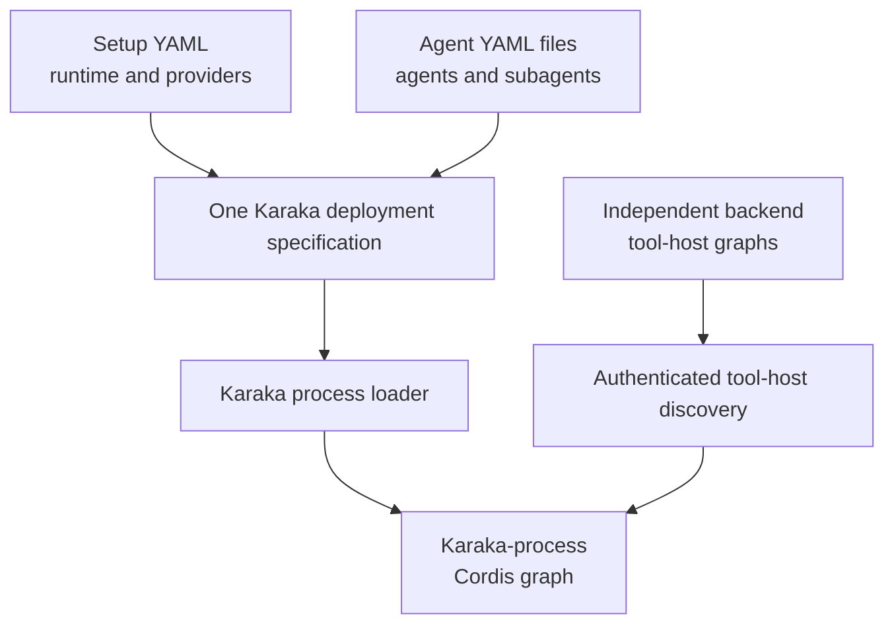
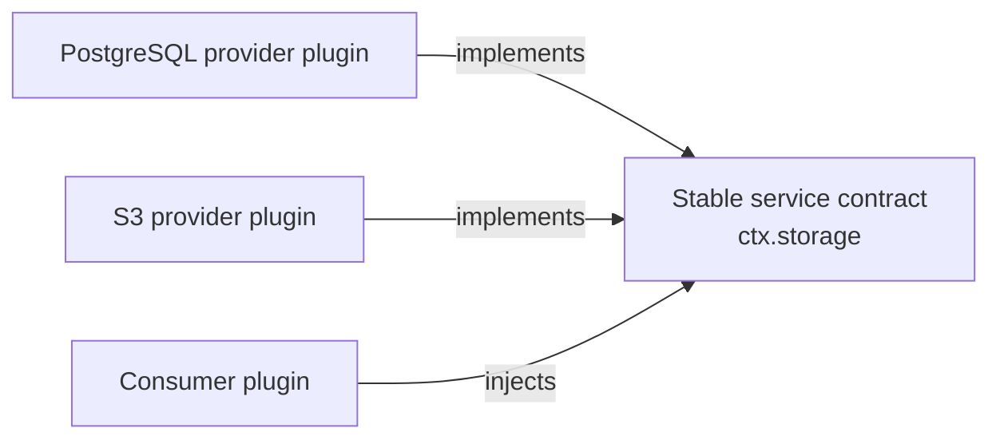
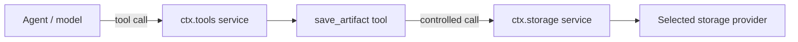
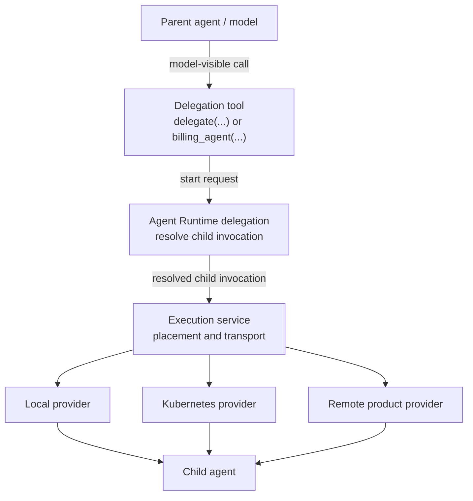
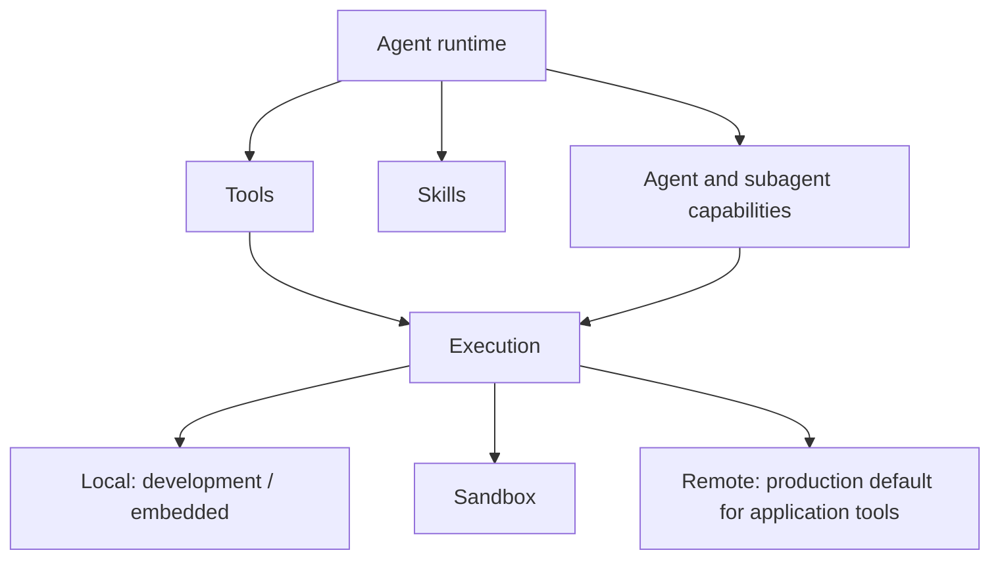
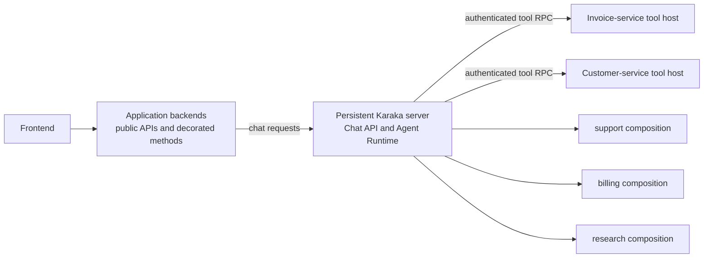

# Architecture

English | [中文](architecture.zh.md)

Karaka is a configurable, Cordis-based foundation for composing agentic SaaS runtimes. Stable capability seams define what the runtime can do, provider plugins decide how and where infrastructure work is done, and application configuration selects the product that runs. A backend-mounted tool-host plugin can turn decorated methods on framework-managed services into agent tools without requiring developers to author one plugin per method.

The repository publishes nine packages that form the composition kernel. Seam contracts, providers, and advanced extensions live in separately installable plugins built on that kernel. Authentication and an initial Agent Runtime registry/model slice exist today. The two-YAML loading contract, tool authoring and hosting APIs, Chat API, subagent coordination, and Execution seam described below are target architecture unless stated otherwise.

## Foundation boundary

`@karaka/cosmokit` supplies small utilities. `@karaka/schemastery` supplies configuration schemas. `@karaka/cordis` owns contexts, services, events, fibers, effects, and dependency tracking.

The composition plugins build on that kernel: Loader imports configured plugins; Include reads YAML or JSON entry lists; Group nests entries; Timer owns disposable scheduling; HMR reloads modules and exact configuration paths; Logger Console renders Cordis logs. Include technically supports JSON, but the target normal Karaka contract exposes only the two YAML surfaces below. JSON and direct Cordis composition are low-level facilities for internals and advanced plugin authors.

Infrastructure capabilities belong above this foundation in first-party, third-party, or private plugins. Karaka may publish contracts, standard agent behavior, and useful providers, but a first-party implementation has no privileged runtime path. Application-owned methods can use Karaka's tool decorator and remain ordinary backend code. The `vendor/` packages remain independent of any particular application, provider, deployment target, or SaaS SDK.

Every configurable or executable runtime behavior must be mounted as a Cordis plugin. Karaka must not introduce a parallel manager, registry, discovery daemon, lifecycle system, or privileged hard-coded behavior. Principals, chats, messages, model responses, and invocation payloads are runtime data rather than plugins; every component that interprets, validates, routes, persists, or acts on that data is a plugin.

## Two YAML surfaces, one composition model

The target developer contract configures Karaka through exactly two YAML surfaces:

1. One **setup YAML** contains everything needed to assemble the runtime: installed seams, providers, transports, credentials references, policy, storage, and the locations of agent files.
2. One or more **agent YAML** files define named, standing Cordis plugin compositions for agents and subagents: prompts, logical model and session references, allowed tool IDs, skills, delegation relationships, and optional custom plugins.

The setup document controls deployment. Agent documents control model-driven behavior. They remain separate so the same agents can move between local, remote, sandboxed, or distributed deployments without describing that placement themselves.



The two surfaces form one Karaka deployment specification and use one composition model: plugins and effect-owned contributions. Each process owns its own Cordis context and graph. An embedded deployment may mount the application tool-host plugin and Agent Runtime in one graph. Independently deployed backends bootstrap their own small tool-host graphs from a framework-specific plugin and application configuration; they do not need to share Karaka's setup YAML or repository. The authenticated manifest and invocation protocols connect those graphs.

The following illustrative partial setup fragment selects providers, discovers remote tool hosts, and points to agent files. Provider names and configuration shapes are planned, not current API:

```yaml
plugins:
  - name: '@karaka/authentication'
  - name: '@karaka/authentication/authentication-jwks'
  - name: '@karaka/storage-postgres'
  - name: '@karaka/execution/remote'
  - name: '@karaka/tool/discovery-kubernetes'
    config:
      selector:
        karaka.ai/tool-host: 'true'
  - name: '@karaka/agent-runtime'
  - name: './plugins/company-authentication-policy'

agents:
  - './agents/support.yaml'
  - './agents/billing.yaml'
```

Each agent file is a named plugin composition. Concise fields configure standard child contributions, while the `plugins` list adds or replaces agent-specific behavior:

```yaml
id: support
prompt:
  file: '../prompts/support.md'
model: support-model-policy
session: durable-chat-policy
tools:
  - customers.read
  - subscriptions.read
  - invoices.refund
subagents:
  billing: billing-agent
plugins:
  - name: '@company/karaka-support-policy'
```

The setup layer resolves agent-file locations but does not interpret their contents. Agent Runtime mounts each file as one isolated, standing Cordis subtree and registers a descriptor for that composition through an effect owned by the subtree. Its agent-YAML interpreter only validates the definition and expands concise fields into configuration for child plugins; it does not execute those behaviors itself. Prompt, model, session, tool, skill, delegation, and custom-plugin contributions therefore share normal Cordis dependency ordering, isolation, disposal, and replacement. Developers author the agent composition in YAML; they need a TypeScript module only for custom behavior. Direct programmatic Cordis composition remains available for Karaka internals, tests, embedded integrations, and advanced plugin authors, but it is not a third normal configuration surface.

## Capability seams

Add an infrastructure or shared runtime capability as three independently replaceable roles:

1. A **service definition** owns the stable name and consumer-facing contract.
2. One or more **provider plugins** implement that contract.
3. **Consumer plugins** depend on the service name instead of importing a provider.

For example, a storage contract may be available as `ctx.storage`. One deployment can install a PostgreSQL provider and another an S3 provider while the same artifact, session, and billing consumers continue to use `ctx.storage`.

An application selects providers through its plugin composition. Cordis dependency tracking starts a consumer only when its required services exist. If a provider disappears or is replaced, Cordis disposes the dependent consumer and starts it again against the new implementation.



The contract must describe the capability, not a provider or consumer. Provider-specific configuration stays with the provider plugin. Consumer-specific workflow stays with the consumer plugin.

Karaka-provided and user-provided plugins use the same contract. Anything a first-party plugin can register, an advanced plugin author must be able to register through the public seam with an ordinary Cordis plugin. Karaka authoring helpers and direct Cordis plugins must receive identical dependency tracking, scoping, effects, disposal, and replacement behavior.

## Top-level seams

Karaka has seven top-level application seams. A seam is an architectural boundary composed from multiple Cordis plugins; it is not necessarily one service or one package. Models, sessions, tools, skills, agents, and subagents are parts of **Agent Runtime**, not peer top-level seams.

| Top-level seam | Responsibility | Example plugin families |
| --- | --- | --- |
| Authentication | Authenticate requests and resolve users, tenants, services, and agents | Provider registry, JWKS verifier, trusted-host identity, user-authored providers and policy |
| Authorization | Decide whether a principal may perform an action on a resource | Contract, policy engines, role or relationship providers, enforcement plugins |
| Entitlement | Resolve plans, features, quotas, and usage allowances | Contract, billing adapters, quota providers, usage policy |
| Storage | Store application data independently of a backend | Contract, PostgreSQL/S3/GCS providers, private storage providers, storage policy |
| Execution | Run work without binding consumers to its location | Contract, local/sandbox/Kubernetes/remote providers, execution policy |
| Observability | Record operational and audit information | Contract, OpenTelemetry/Datadog exporters, audit and usage plugins |
| Agent Runtime | Run and coordinate model-driven work | Model adapters, sessions, tool registry and tools, skills, agent loop, agent registry, subagent registry and providers |

Each deployment composes the plugins it needs within every seam. Karaka publishes useful defaults as ordinary first-party plugins, while an application can add or replace them through the same Cordis contracts. In particular, a standard agent bundle can compose the default loop, session coordination, tool-call handling, user interaction, delegation, child control, skill resolution, cancellation, and runtime events without hard-coding those behaviors into Agent Runtime. Ordinary backend methods use the tool decorator described below and do not require developers to author one plugin per method.

## Authentication and invocation identity

`ctx.authentication` is a long-lived provider registry and tenant-aware authentication service. An authenticated principal is short-lived invocation data, not a Cordis service and not a plugin mounted for each caller. Karaka resolves the principal at its runtime boundary and carries it through the chat turn internally. Application code and model-visible tool arguments must not choose the effective caller.

Karaka ships two ordinary plugins for the first trust models:

| Plugin | Trust boundary | Result |
| --- | --- | --- |
| `@karaka/authentication/authentication-jwks` | Karaka receives a bearer token and verifies it against preconfigured tenant JWKS policy | Returns a verified provider-neutral identity through `ctx.authentication.authenticate(...)` |
| `@karaka/authentication/authentication-host` | The embedding host has already authenticated the caller and exposes its current principal through a trusted adapter | Resolves a provider-neutral identity with `provider: 'host'` |

The current `authentication-host` implementation still establishes `ctx.identity` in a Cordis scope. It must be refactored to the invocation resolver described here before it can back the multi-user Chat API; the existing scoped-service pattern is not the target application abstraction.

The host plugin is the common shared-process and local-development path. A single-identity development deployment may select a trusted static assertion from YAML:

```yaml
- name: '@karaka/authentication/authentication-host'
  config:
    tenantId: local
    subject: developer
    claims:
      role: developer
```

This configuration is trusted input. It must never be generated from model output or copied directly from request parameters. As an explicit embedded or custom-integration escape hatch, a multi-user host may programmatically install one adapter that reads the host framework's request-local principal:

```ts
const authentication = authenticationHost({
  currentPrincipal: () => hostAuthentication.currentPrincipal(),
})
```

The adapter is mounted once as an ordinary Cordis plugin. This is not a normal third configuration surface. Its callback is illustrative: an integration can use framework request state, asynchronous local storage, or another host mechanism, but it must not use one mutable global principal. Concurrent callers in that process share the Karaka runtime and plugin graph while the host adapter resolves a different principal for each invocation.

Identity alone never permits an action. Authorization plugins must compare the internally carried principal, requested action, and canonical resource ownership. Model-facing tools obtain the acting tenant and subject from the Agent Runtime invocation, scope storage operations to that tenant, and require an explicit cross-user permission before targeting another subject. Giving an agent an identity therefore identifies whose authority it may request; it does not grant arbitrary access to every identity.

## Services and tools

A **service** is a runtime-facing capability exposed through the Cordis context. Plugins use services to cooperate without importing one another's implementations. A top-level seam may use one service or coordinate several internal services and registries.

A **tool** is an operation intentionally exposed to a model inside the Agent Runtime seam. A core Tool plugin will provide an internal service such as `ctx.tools`; it will own model-visible names, schemas, agent allowlists, semantic validation, and cleanup. Tool-host, manifest-bridge, discovery-provider, and tool-policy implementations are ordinary Cordis plugins in the Tool plugin family. Placement and transport belong to Execution, whose local, sandbox, Kubernetes, and remote implementations are Execution provider plugins because Execution also places work other than tool calls. Execution dispatches an already-resolved operation locally or to the application that owns it; it does not interpret model-visible schemas.

### Tool package boundary

The first-party Tool family will be published as the separately installable `@karaka/tool` package. It is an application-capability package above the nine-package kernel, not a new top-level seam.

The package root exports the metadata-only `tool` decorator and shared TypeScript contracts, schemas, and metadata types. These exports are inert: importing `@karaka/tool` neither mounts behavior nor registers a tool. First-party runtime behavior is exposed through plugin subpaths of the same package. The target naming convention includes `@karaka/tool/core`, framework-specific `@karaka/tool/host-*`, `@karaka/tool/discovery-*`, `@karaka/tool/manifest-bridge`, and `@karaka/tool/policy-*`. Each behavioral subpath exports an ordinary Cordis plugin, and every registration it makes is owned by a reversible effect. The exact list grows with implementations, but first-party Tool behavior must not escape this plugin contract.

Third-party and private Tool-family plugins may use their own package names. They integrate through the same public Tool contracts and Cordis lifecycle; they do not receive a separate registry or extension mechanism. Placement and transport providers remain in the Execution package family, such as `@karaka/execution/remote`, because they serve tools, subagents, sandbox work, and other executable workloads.

| Property | Service | Tool |
| --- | --- | --- |
| Primary caller | Runtime and plugins | Agent or model |
| Discovery | Stable `ctx.<name>` contract | Registered schema in a tool registry |
| Typical scope | Infrastructure or shared domain capability | Narrow, authorized action |
| Example | `ctx.storage.put(...)` | `save_artifact(...)` |
| Model-visible by default | No | Yes |

Registering `ctx.storage` must not make raw storage methods available to a model. A `save_artifact` tool can validate a narrow input, apply policy, call `ctx.storage`, and return a bounded result. This separation keeps internal authority out of the model-facing surface.



The same pattern applies to SaaS domains, but normal application developers should not write a plugin or setup entry for every method. Karaka will provide a decorator for methods on services already created by the backend framework. The following API is illustrative:

```ts
import { tool } from '@karaka/tool'

class InvoiceService {
  @tool({
    id: 'invoices.refund',
    description: 'Refund an eligible invoice.',
    input: RefundInvoiceInput,
    output: RefundInvoiceOutput,
    permission: 'invoices.refund',
  })
  async refund(input: RefundInvoice) {
    return this.database.transaction(() => this.refundInvoice(input))
  }
}
```

`@tool` will attach metadata only. It is an inert authoring helper, not a second plugin system. Importing a decorated class will not register it or mutate a global registry. A framework-specific application tool-host plugin will enumerate backend-managed instances during application bootstrap, read their tool metadata, bind the methods, and register local execution handlers through reversible Cordis effects. The host plugin owns those effects, so disposal removes the handlers. The decorator must not create another service container, lifecycle, registry, or non-disposable global side channel. A framework with no inspectable container may require one application-level host registration point, but never one YAML entry per method.

In a remote deployment, every application or microservice tool-host plugin will serve a versioned manifest of its bound tools over an authenticated channel. An agent-process discovery bridge plugin will find trusted tool hosts through a static or service-discovery provider plugin such as Kubernetes, Consul, or Cloud Map; authenticate each host; fetch and validate its manifest; and register model-visible descriptors in Agent Runtime through reversible effects. The discovery and bridge roles remain plugins in the Tool family; there is no separate discovery daemon or lifecycle outside Cordis. The bridge consumes Execution contracts for reachable invocation endpoints rather than creating a Tool-specific transport system. The application graph therefore owns handler effects, while the agent graph owns descriptor effects. Repositories and source languages do not form the integration boundary: the manifest and invocation protocols must be language-neutral. A shared-process development or embedded deployment may combine both roles in one graph without changing their ownership.

The tool host will expose one manifest operation and one invocation dispatcher for all decorated methods; the decorator will not create one network route per method. Tool RPC authentication has two layers. Service authentication, such as mTLS or a service credential, proves that the call came from an authorized Karaka deployment. A short-lived, signed delegation carries the verified principal and tenant whose authority the invocation may exercise. The model cannot supply or modify either identity. On every call, the application host authenticates the service and delegation, validates the input, applies the tool's declared permission through Authorization, executes the bound method, validates the output, and records the audit event.

A conceptual invocation envelope contains an invocation ID, logical tool ID and version, validated input, deadline, and signed delegation. Credentials and the effective principal are transport metadata, never model-visible tool arguments. The manifest and invocation protocol are shared contracts, while authentication mechanisms remain replaceable providers selected in setup.

The setup YAML will configure one or more tool-host discovery providers, not one entry per method or source repository. Each backend discovers its own decorated methods; Karaka discovers authenticated running hosts and their manifests. Remote execution is the production default for application-owned tools because business logic remains with the service that owns its data, transactions, and authorization. Local execution inside Karaka is reserved for Karaka-owned control capabilities, tests, and explicit embedded deployments. Both placements expose logical tool IDs to Agent Runtime without putting endpoints in agent YAML.

An agent YAML will explicitly select the registered tools it may use:

```yaml
id: support
tools:
  - customers.read
  - invoices.refund
```

Discovery makes a tool available to the runtime; it does not grant every agent access. Agent activation must fail if an allowed tool is absent from the verified manifests or its version or schema is incompatible. Agent Runtime validates model arguments before asking Execution to transport a call. The owning backend validates the input again, authorizes the internally carried principal, executes the bound method, and validates its output. Agent Runtime validates the returned output before giving it to the model. Tool IDs must be globally stable, and discovery must reject conflicting owners or incompatible descriptors instead of depending on arrival order. Karaka-native control tools may be contributed by Agent Runtime plugins, but application business tools normally remain remote.

## Chat ownership and application API

Karaka owns the agent, chat, session, model and tool orchestration. Ordinary application code supplies a message and, when continuing an existing chat across a stateless boundary, an opaque chat identifier. It does not construct an identity, invocation context, agent instance, session object, or conversation state.

A future application-facing API should preserve this boundary. The names below are illustrative:

```ts
const chat = await karaka.chat.create()

const first = await chat.send('Help me review this invoice')

const later = await karaka.chat.send({
  chatId: chat.id,
  message: 'Now explain the refund policy',
})
```

The bound `chat.send(message)` and stateless `karaka.chat.send({ chatId, message })` forms invoke the same operation. The chat handle only retains the opaque identifier for the application. Karaka owns the associated identity binding, selected agent, session state, history, and execution metadata.

Creating a chat coordinates the installed seams:

```text
chat.create()
    -> authenticate the current caller
    -> authorize chat creation
    -> check entitlements
    -> select an agent through the installed routing policy
    -> resolve Agent Runtime contributions
    -> create and persist session state and chat ownership
    -> return an opaque chat ID
```

Sending a message restores and enforces that state:

```text
chat.send({ chatId, message })
    -> authenticate the current caller
    -> load the chat
    -> authorize that caller against canonical chat ownership
    -> restore the selected agent and session state
    -> resolve models, tools, skills and delegation policy
    -> execute and persist the turn
    -> return the response
```

A chat ID is a locator, never proof of authority. Karaka must authenticate and authorize every operation so one user cannot gain access by presenting another user's chat ID. One standing agent composition can serve many concurrent callers. Each active chat may own an ephemeral runtime scope joined to that composition, but principals, messages, histories, and durable plugin state remain invocation or session data rather than services mounted once per request.

## Agent Runtime internals

Agent Runtime is one top-level seam composed from model, session, tool, skill, agent, and subagent components. Provider and integration plugins may expose internal Cordis services so these components remain replaceable without becoming top-level Karaka seams.

### Agent definitions and contributions

Developers will define every agent and subagent as a named Cordis plugin composition in agent YAML, while Karaka will mount and run them. The definition is a standing composition shared by many chats, not a live conversation object or a TypeScript module that ordinary developers must write. A subagent is another named composition referenced by a parent.

For example, `agents/support.yaml` can contain:

```yaml
id: support
prompt:
  file: '../prompts/support.md'
model: support-model-policy
session: durable-chat-policy
tools:
  - customers.read
  - subscriptions.read
  - invoices.refund
subagents:
  billing: billing-agent
  research: customer-research-agent
plugins:
  - name: '@company/karaka-support-policy'
```

References in an agent composition name logical capabilities or policies, not concrete provider objects or endpoints. Authenticated remote manifests provide logical application-tool names; setup-selected model and session providers satisfy the other references. Replacing OpenAI with DeepSeek, PostgreSQL with another session backend, or a remote execution transport therefore does not require rewriting the agent.

Agent Runtime mounts each agent file as a composition root with an isolated standing scope. The root owns its descriptor, shorthand-field contributions, explicit child plugins, and cleanup. Concise `prompt`, `model`, `session`, `tools`, `skills`, and `subagents` fields configure first-party child plugins; the `plugins` list mounts additional Cordis modules in the same scope. The expansion is inspectable, and the interpreter contains no hidden implementation of the selected behavior. File removal, replacement, and hot reload therefore use the same dependency and effect lifecycle as every other plugin subtree instead of translating the agent into a flat `{ id, prompt, model }` registry object.

Karaka should ship good defaults as ordinary first-party plugins. A standard agent bundle is itself a Cordis plugin that mounts child plugins for the default agent loop, session coordination, model/tool-call processing, user-interaction capability, subagent delegation and control, skill resolution, cancellation limits, and runtime events. Its final package or export boundary is deliberately not fixed here. Some of these capabilities expose model-facing tools, while others are internal services or events. Applications can use the bundle without configuring every component and can replace a behavior through the same public Cordis seams; the loop must not contain a privileged hard-coded version of a replaceable policy. A resolved-composition inspection command should expose the concrete plugins behind any bundle.

Agent YAML does not implicitly inherit another agent YAML. Reuse comes from shared plugin packages, standard bundles, and Cordis parent scopes. A `subagents` entry declares delegation, not prompt, tool, session, or authority inheritance. Any future definition-level inheritance must specify deterministic merge, cycle, reload, and version rules before becoming part of the public format.

Agent routing will remain a setup-selected plugin contribution. On `chat.create()`, Karaka will ask the installed routing policy to select among available YAML definitions using trusted runtime information such as the authenticated principal, tenant, entitlements, and product configuration. A product may optionally expose an agent choice as an application-level request, but Karaka will still authorize and resolve that request; the application will not construct the agent.

Agent compositions, extensions, routers, tool semantics, model policies, session policies, and delegation semantics all live inside the Agent Runtime seam. They may use internal services such as `ctx.agentRuntime`; they do not become additional top-level seams. Advanced plugins may contribute behavior or generate compositions, but the normal developer surface remains agent YAML.

Plugins define behavior and capabilities. A principal, chat, message, model response, or tool invocation is runtime data flowing through those plugins, not another plugin. This distinction preserves Cordis composition without misusing service isolation for per-request state.

### Composition generations and durable chat state

A standing agent composition is process-local executable state; a chat is durable application state. Chat storage must record the agent ID, composition generation or content hash, messages, model requests and responses, tool calls and results, turn boundaries, and every plugin-owned fact needed to reconstruct behavior. Essential plugin state cannot live only in an in-memory map. External effects require stable invocation IDs so recovery does not duplicate work.

When an agent file or installed plugin changes, Karaka validates and mounts a new composition generation before routing new work to it. Existing live chats may remain pinned to their active generation until a safe boundary. After a process restart, no old Cordis fiber remains: resuming a chat creates a fresh live scope against the currently deployed compatible generation, loads its durable log, and lets the mounted plugins rebuild their projections before publication. If the recorded generation differs, Karaka records an explicit composition transition and requires the new plugins to understand or migrate the stored event versions. Exact historical execution is a different policy and requires retaining the historical deployment artifact; Cordis cannot reconstruct code that is no longer deployed.

An agent is a runtime participant with its own conversation state, tools, skills, and authority. A subagent is not simply a direct child object exposed to the parent model. The target Agent Runtime delegation path has three layers:

1. A **model-facing tool** accepts a task from the parent agent.
2. An **Agent Runtime delegation policy** resolves the named child, decides conversation inheritance and explicitly granted capabilities, and constructs the complete child invocation.
3. The **Execution service** places and transports that resolved invocation locally, in a sandbox, or in a remote runtime.



The model-facing API can be one generic tool with an agent selector or several domain-specific tools. A `research_agent` tool might route to Kubernetes while a `billing_agent` tool routes to a remote application runtime. The parent model and agent YAML do not need to know how either child is executed.

Control and reporting are explicit capabilities. Operations such as sending a follow-up, interrupting a child, listing children, or reporting a result should be separate tools or service methods with their own policy. Parent and child must not communicate through hidden shared mutable state.

Conversation inheritance, runtime composition, and authority are independent decisions owned by Agent Runtime and its delegation policy. The policy may fork the parent conversation, start with a fresh prompt, or delegate to a remote product. It constructs a resolved child invocation containing only the context and capabilities explicitly granted to that child. Execution may place and transport that invocation; it must not infer, add, or reinterpret conversation context, tools, services, credentials, filesystem access, or permissions.

## Deployment is below the capability model

Agent Runtime describes what tools and agents mean. Execution decides where and how their work runs. It owns placement, transport, dispatch, deadlines, cancellation, and provider selection without understanding prompts or model-visible schemas. Keeping these dimensions separate allows the same capability to move between in-process, sandboxed, Kubernetes, or remote execution without changing the model-facing contract.



Deployment placement also does not imply authorization. Authentication, authorization, entitlement, credentials, and audit policy remain applied at runtime boundaries regardless of provider location.

### Running Karaka and scaling agents

The target server deployment starts one persistent Karaka process from the setup YAML. A future executable entrypoint, conceptually `karaka start --config karaka.yaml`, will create the root Cordis context, load setup and agent files, mount the Chat API and selected providers, and keep the process alive. This name is illustrative, not current API.

One process mounts many standing agent compositions. An agent composition is not a process, so adding support, billing, research, or reporting does not require another server. Each chat resolves one composition and carries separate principal, session, history, and execution state. A subagent is another composition and initially runs through the same runtime unless Execution policy places it in an isolated or remote worker.



The baseline production topology therefore has existing application services and one Karaka server. Every application deployment contains its decorated methods and a small tool-host plugin; the Karaka deployment contains Agent Runtime, agent compositions, agent-side plugins, model provider plugins, Tool discovery plugins, and a remote Execution provider plugin. Neither deployment absorbs the other's implementation. Karaka-native control capabilities may run locally as first-party plugins, but application business operations remain in the services that own their data and authorization.

For a microservice product, a small Karaka deployment project is the recommended assembly point. It contains the setup YAML, agent YAML, prompts, package manifest and lockfile, and optional local agent-side plugin source. Agent-side plugins owned by other repositories are published or otherwise installed into this deployment artifact. Microservice repositories keep their backend code, decorators, and tool-host plugin. The repository name and directory layout are conventions, not runtime contracts; a smaller or embedded product may keep the same files under an application directory.

Tool discovery follows deployment state rather than repository layout. Each service discovers decorated methods on its own framework-managed instances and publishes an authenticated, versioned manifest. A setup-selected discovery plugin watches trusted service records, fetches manifests, groups compatible replicas, and contributes descriptors and Execution endpoints through effects. Adding a method does not require a central setup row, but an agent must still name the logical tool in its allowlist before the model can request it.

Capacity scaling uses multiple identical Karaka replicas behind the deployment platform's load balancer. Every replica loads the same versioned setup and agent compositions. Chat ownership, history, session state, and execution metadata must live in shared durable Storage rather than process memory so any replica can continue a chat. Replica count belongs to Docker, Kubernetes, ECS, systemd, or another deployment system; setup may define runtime concurrency and resource policy, but agent YAML never defines process count.

Additional worker roles are introduced only for a concrete placement need, such as untrusted sandbox execution, durable background work, isolated subagents, or self-hosted inference. Execution routes those resolved workloads without changing agent compositions or creating a process per agent.

## Application and extension APIs

A future Karaka code API has two deliberately different purposes:

1. The application-facing Chat API provides simple imperative operations such as creating a chat and sending a message. Karaka performs the cross-seam orchestration behind that facade.
2. The `@tool` decorator marks methods on backend-managed application services for that backend's installed tool host to register.

These APIs do not form another Karaka definition format. Setup remains in one setup YAML, and agents and subagents remain in agent YAML files. A backend's framework bootstrap and ordinary deployment configuration install its tool host but do not define agents. In particular, the normal API does not provide a programmatic `defineAgent` path parallel to agent YAML.

A remote deployment uses two role-specific plugins from the Tool family. Each backend bootstraps an application tool-host plugin that turns decorated metadata into Cordis-owned Execution handlers. Karaka's setup selects a discovery-bridge plugin that turns verified manifests into Cordis-owned Agent Runtime descriptors. Each plugin is mounted once in its process and uses that process's service container, registries, effects, scopes, and dependency ordering. A shared-process deployment may mount both roles in one graph.

Conceptually:

```text
@tool metadata on a backend-managed method
        |
        v
application tool-host plugin
        |
        v
reversible Execution handler effects

authenticated, verified manifest
        |
        v
agent bridge plugin
        |
        v
reversible Agent Runtime descriptor effects
```

Advanced developers can author ordinary Cordis plugins to add or replace services, providers, policies, registries, and agent behavior. Agent-side plugin modules must be installed in the Karaka deployment artifact and referenced by setup or agent YAML; backend tool implementations stay in their owning application artifact. Direct programmatic composition is reserved for internals, tests, embedded plugin integrations that require runtime values, and custom plugin authors.

The code API must not create parallel storage, authentication, Agent Runtime, lifecycle, tool, or plugin registries. In each process, the Chat API and tool-host plugins delegate to services and contributions in that process's Cordis graph; they do not own hidden registries or permanent global registrations. Two composition systems would duplicate dependency ordering, scoping, cleanup, and hot replacement, and would make Cordis lifecycle guarantees stop at the code API boundary.

Plugin authors can replace a provider, add a definition extension, install a policy, or use Cordis directly without leaving the architecture. Ordinary application request code should not see `ctx`, provider names, authentication assertions, invocation envelopes, session objects, or Cordis scopes.

## Ownership and scope

Every service registration, agent descriptor, tool definition, provider entry, listener, child plugin, and scheduled resource is an effect owned by its contributing plugin. Disposing an agent composition root must dispose its child plugins and reverse every contribution. Registries must not retain disposed entries or children.

Use Cordis service isolation for plugin-graph composition, including a standing agent subtree that needs a distinct implementation or registry view. A live chat may temporarily join that composition through an owned runtime scope, but service isolation must not represent the durable request, principal, message, or chat state. That state is loaded from Storage and carried internally through the execution path. Scope narrows service resolution; it does not establish or copy authority automatically. Policies should be attached at the service or execution seam they govern so every consumer, including a model-facing tool, passes through the same enforcement point.

The Loader and Include modifications recorded in [vendor/README.md](../vendor/README.md) preserve transactional updates so a rejected configuration does not destroy the active tree.

## Design rules

- Keep one composition system: Cordis.
- Implement every configurable or executable runtime behavior as a Cordis plugin; do not add parallel lifecycle, registry, or discovery systems.
- Use one Karaka deployment specification and one Cordis graph per process; connect independently deployed backend graphs through authenticated protocols rather than shared configuration.
- Expose exactly two normal configuration surfaces: one setup YAML and one or more agent YAML files.
- Put runtime assembly, providers, transports, policy, and agent-file locations in setup YAML.
- Make each agent YAML a named, standing Cordis plugin composition containing prompts, logical capability references, tool allowlists, subagent references, and optional custom plugins.
- Make ordinary providers addressable as plugin modules with serializable setup configuration.
- Give first-party, third-party, and private plugins the same public extension path.
- Name services after capabilities, not vendors.
- Keep service contracts independent of providers and consumers.
- Keep models, sessions, tools, skills, agents, and subagents inside the Agent Runtime seam.
- Publish the first-party Tool family as the separate `@karaka/tool` package: keep inert authoring contracts at its root and expose runtime behavior as Cordis plugin subpaths.
- Let applications create chats and send messages without constructing identities, sessions, agents, or invocation contexts.
- Treat a chat ID as an opaque locator and authenticate and authorize every chat operation.
- Mount each agent YAML as an isolated composition root whose descriptor, child plugins, and contributions have one reversible Cordis lifecycle.
- Let ordinary developers compose an agent in YAML without requiring a matching TypeScript module or programmatic agent-definition API.
- Ship useful default agent behavior as replaceable first-party plugins and an inspectable standard bundle that is itself a plugin mounting child plugins; do not hard-code replaceable policy in the agent loop.
- Treat subagent references as delegation rather than implicit definition, prompt, tool, session, or authority inheritance.
- Persist every chat and plugin-owned fact required for reconstruction; resume under a new compatible composition generation only through explicit version handling or migration.
- Keep principals, chats, messages, responses, and invocations as runtime data rather than Cordis plugins or services.
- Expose model actions through narrow tools; do not expose whole services implicitly.
- Let methods on backend-managed application services become tools through `@tool`, without per-method YAML or authored plugins.
- Make decorators metadata-only; importing application code must not mutate a registry.
- Mount one tool-host plugin from the Tool plugin family during each backend's bootstrap, enumerate its managed instances, bind decorated methods, and register them through reversible Cordis effects.
- Discover remote tool hosts through setup-selected static or service-discovery plugins, then consume authenticated, versioned, schema-verified manifests and fail agent activation when required tools are missing or incompatible.
- Group tool host, discovery, manifest-bridge, and policy implementations in the Tool plugin family; keep Tool as an Agent Runtime component rather than a top-level seam, and put placement, transport, and invocation in Execution provider plugins.
- Configure tool-host discovery rather than individual methods or source repositories; keep production application tools remote and reserve local execution for Karaka-owned controls, tests, and explicit embedded use.
- Expose decorated application methods through one authenticated manifest and invocation dispatcher per tool host, not one route or setup entry per method.
- Authenticate both the Karaka service and the short-lived delegated principal on every remote tool invocation; never accept authority from model arguments.
- Keep tool registration separate from the application service or method a tool consumes.
- Resolve subagent conversation, context, capability, credential, and authority inheritance and the complete child invocation in Agent Runtime; let Execution only place and transport it.
- Treat agents and subagents as standing plugin compositions in a shared runtime, not as processes.
- Start with one persistent Karaka server, scale with identical replicas and shared durable state, and add specialized workers only for placement or isolation.
- Keep replica count in the deployment platform rather than agent YAML.
- Specify context, tool, credential, and authority inheritance independently.
- Select providers in application composition, not in capability consumers.
- Register every contribution as a reversible Cordis effect.
- Keep product behavior out of the nine-package kernel; use backend-owned decorated methods for business operations and agent-side plugins for advanced orchestration behavior.
