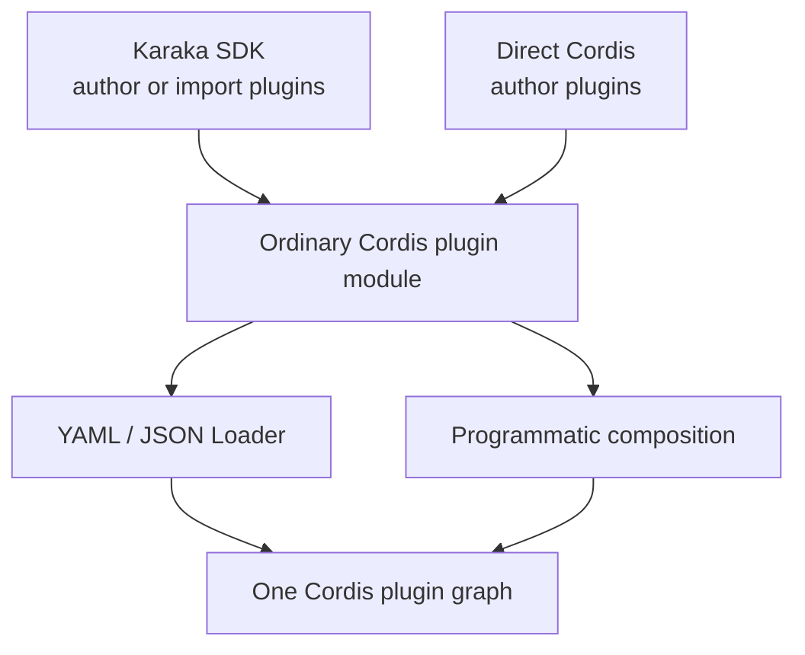
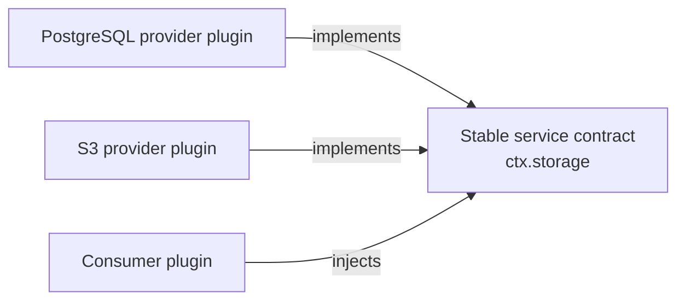
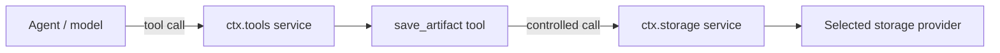
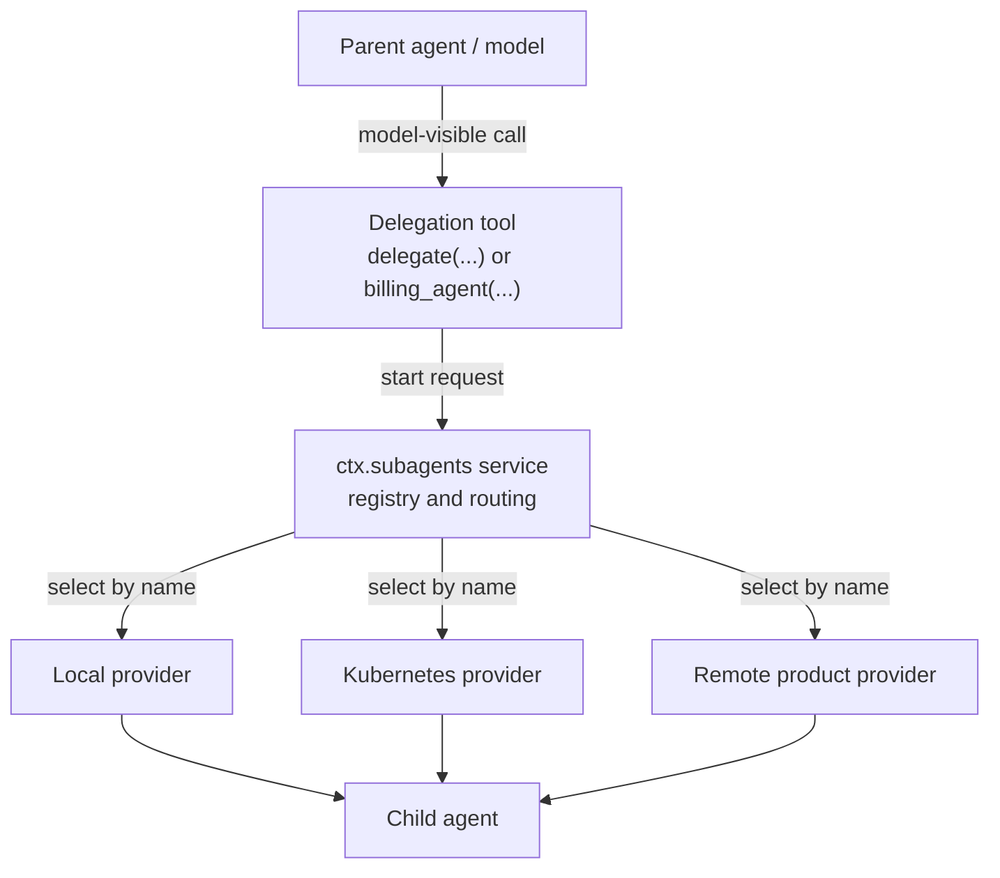
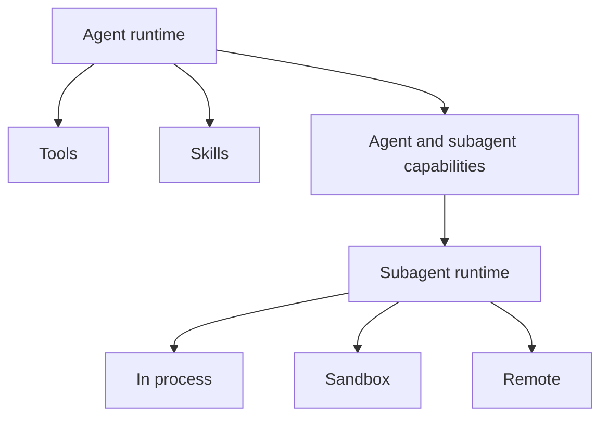

# Architecture

English | [中文](architecture.zh.md)

Karaka is a configurable, Cordis-based foundation for composing agentic SaaS runtimes. Its architecture is a plugin ecosystem: stable capability seams define what the runtime can do, provider plugins decide how and where it is done, and application configuration selects the product that runs.

The repository publishes nine packages that form the composition kernel. Application capabilities live in separately installable plugins built on that kernel. Authentication is the first implemented application seam; storage, execution, observability, and Agent Runtime remain architectural boundaries for later packages.

## Foundation boundary

`@karaka/cosmokit` supplies small utilities. `@karaka/schemastery` supplies configuration schemas. `@karaka/cordis` owns contexts, services, events, fibers, effects, and dependency tracking.

The composition plugins build on that kernel: Loader imports configured plugins; Include reads YAML or JSON entry lists; Group nests entries; Timer owns disposable scheduling; HMR reloads modules and exact configuration paths; Logger Console renders Cordis logs.

Application capabilities belong above this foundation in first-party, third-party, or private plugins. Karaka may publish contracts and useful providers, but a first-party provider has no privileged runtime path. The `vendor/` packages remain independent of any particular application, provider, deployment target, or SaaS SDK.

## One graph, two front doors

Configuration is a core architectural boundary. YAML or JSON composition and a future TypeScript SDK are two ways to build the same Cordis plugin graph.



The canonical deployable unit is a plugin module plus configuration. Loader can select a published provider or a private application plugin without knowing how it was authored:

```yaml
- name: '@karaka/authentication'
- name: '@karaka/authentication/authentication-jwks'
- name: '@karaka/storage-postgres'
- name: '@karaka/execution-kubernetes'
- name: './plugins/company-billing'
- name: './plugins/company-authentication-policy'
```

Another deployment can replace any row while retaining the consumers. Loader resolves each module and ultimately mounts it through Cordis. Programmatic composition mounts the same plugin exports directly. Neither path creates another service container or lifecycle system.

## Capability seams

Add an application capability as three independently replaceable roles:

1. A **service definition** owns the stable name and consumer-facing contract.
2. One or more **provider plugins** implement that contract.
3. **Consumer plugins** depend on the service name instead of importing a provider.

For example, a storage contract may be available as `ctx.storage`. One deployment can install a PostgreSQL provider and another an S3 provider while the same artifact, session, and billing consumers continue to use `ctx.storage`.

An application selects providers through its plugin composition. Cordis dependency tracking starts a consumer only when its required services exist. If a provider disappears or is replaced, Cordis disposes the dependent consumer and starts it again against the new implementation.



The contract must describe the capability, not a provider or consumer. Provider-specific configuration stays with the provider plugin. Consumer-specific workflow stays with the consumer plugin.

Karaka-provided and user-provided plugins use the same contract. Anything a first-party plugin can register, a user must be able to register through the public seam with an ordinary Cordis plugin. Users may use Karaka authoring helpers or Cordis directly; both must receive identical dependency tracking, scoping, effects, disposal, and replacement behavior.

## Top-level seams

Karaka has seven top-level application seams. A seam is an architectural boundary composed from multiple Cordis plugins; it is not necessarily one service or one package. Models, sessions, tools, skills, agents, and subagents are parts of **Agent Runtime**, not peer top-level seams.

| Top-level seam | Responsibility | Example plugin families |
| --- | --- | --- |
| Authentication | Authenticate requests and resolve users, tenants, services, and agents | Provider registry, JWKS verifier, trusted-host identity, user-authored providers and policy |
| Authorization | Decide whether a principal may perform an action on a resource | Contract, policy engines, role or relationship providers, enforcement plugins |
| Entitlement | Resolve plans, features, quotas, and usage allowances | Contract, billing adapters, quota providers, usage policy |
| Storage | Store application data independently of a backend | Contract, PostgreSQL/S3/GCS providers, private storage providers, storage policy |
| Execution | Run work without binding consumers to its location | Contract, local/sandbox/Kubernetes/remote providers, execution policy |
| Observability | Record operational and audit information | Contract, OpenTelemetry/Datadog exporters, audit and usage plugins |
| Agent Runtime | Run and coordinate model-driven work | Model adapters, sessions, tool registry and tools, skills, agent loop, agent registry, subagent registry and providers |

Each deployment composes the plugins it needs within every seam. Karaka can publish default contracts and providers, while an application can add or replace them with ordinary Cordis plugins. SaaS domain plugins such as billing, research, support, or reporting consume these seams and may contribute additional services or Agent Runtime tools.

## Authentication and contextual identity

Authentication has two related but distinct outputs. `ctx.authentication` is the provider registry and tenant-aware verification service. `ctx.identity` is the principal established for one request, session, job, or agent run. Consumers that act for a caller inject `identity`; they must not accept the effective caller from model-visible tool arguments.

Karaka ships two ordinary plugins for the first trust models:

| Plugin | Trust boundary | Result |
| --- | --- | --- |
| `@karaka/authentication/authentication-jwks` | Karaka receives a bearer token and verifies it against preconfigured tenant JWKS policy | Returns a verified provider-neutral identity through `ctx.authentication.authenticate(...)` |
| `@karaka/authentication/authentication-host` | The embedding host has already authenticated the caller and asserts the resulting principal | Provides contextual `ctx.identity` with `provider: 'host'` |

The host plugin is deliberately small because it is the common embedded and local-development path. A single-identity development deployment can select it directly from YAML:

```yaml
- name: '@karaka/authentication/authentication-host'
  config:
    tenantId: local
    subject: developer
    claims:
      role: developer
```

This configuration is trusted input. It must never be generated from model output or copied directly from request parameters. A shared-process host creates a fresh identity scope per caller and mounts the same plugin programmatically:

```ts
const caller = ctx.isolate('identity')

await caller.plugin(AuthenticationHost, {
  tenantId: hostPrincipal.tenantId,
  subject: hostPrincipal.subject,
  claims: hostPrincipal.claims,
})

await caller.plugin(agentRun)
```

The process is shared; the authority is not. Unique identity scopes prevent concurrent callers from overwriting or observing one another's principal, and Cordis disposal removes the identity with the caller's plugin graph.

Identity alone never permits an action. Authorization plugins must compare the contextual principal, requested action, and canonical resource ownership. Model-facing tools should derive the acting tenant and subject from `ctx.identity`, scope storage operations to that tenant, and require an explicit cross-user permission before targeting another subject. Giving an agent an identity therefore identifies whose authority it may request; it does not grant arbitrary access to every identity.

## Services and tools

A **service** is a runtime-facing capability exposed through the Cordis context. Plugins use services to cooperate without importing one another's implementations. A top-level seam may use one service or coordinate several internal services and registries.

A **tool** is an operation intentionally exposed to a model inside the Agent Runtime seam. A future tool registry would itself be an internal service such as `ctx.tools`; tool plugins would contribute model-visible schemas and executors to that service. The registry would own discovery, dispatch, policy, and cleanup. Individual tools would normally call services from other top-level seams to do their work.

| Property | Service | Tool |
| --- | --- | --- |
| Primary caller | Runtime and plugins | Agent or model |
| Discovery | Stable `ctx.<name>` contract | Registered schema in a tool registry |
| Typical scope | Infrastructure or shared domain capability | Narrow, authorized action |
| Example | `ctx.storage.put(...)` | `save_artifact(...)` |
| Model-visible by default | No | Yes |

Registering `ctx.storage` must not make raw storage methods available to a model. A `save_artifact` tool can validate a narrow input, apply policy, call `ctx.storage`, and return a bounded result. This separation keeps internal authority out of the model-facing surface.



The same pattern applies to SaaS domains. A billing plugin can inject authentication, authorization, entitlement, and storage services, then contribute narrow tools such as `create_invoice` or `refund_invoice` to Agent Runtime. Those registrations must be effects owned by the billing plugin.

## Agent Runtime internals

Agent Runtime is one top-level seam composed from model, session, tool, skill, agent, and subagent plugins. These plugins may expose internal Cordis services so they remain replaceable without becoming top-level Karaka seams.

An agent is a runtime participant with its own conversation state, tools, skills, and authority. A subagent is not simply a direct child object exposed to the parent model. Within Agent Runtime, delegation has three layers:

1. A **model-facing tool** accepts a task from the parent agent.
2. A **subagent service** such as `ctx.subagents` selects a named provider and coordinates the run.
3. A **provider plugin** starts or contacts the child in a particular execution environment.



The model-facing API can be one generic tool with an agent or provider selector, or several domain-specific tools backed by different providers. A `research_agent` tool might route to Kubernetes while a `billing_agent` tool routes to a restricted local runtime. The parent model does not need to know how either child is executed.

Control and reporting are explicit capabilities. Operations such as sending a follow-up, interrupting a child, listing children, or reporting a result should be separate tools or service methods with their own policy. Parent and child must not communicate through hidden shared mutable state.

Conversation inheritance, runtime composition, and authority are independent decisions. A provider may fork the parent conversation, start with a fresh prompt, or delegate to a remote product. None of those choices automatically grants the child the parent's tools, services, credentials, filesystem, or permissions. A provider contract must state its inheritance behavior, and the composition must grant child capabilities explicitly.

## Deployment is below the capability model

Tools and agents describe what the application can do. Providers decide where and how the work runs. Keeping these dimensions separate allows the same capability to move between in-process, sandboxed, Kubernetes, or remote execution without changing the model-facing contract.



Deployment placement also does not imply authorization. Authentication, authorization, entitlement, credentials, and audit policy remain applied at runtime boundaries regardless of provider location.

## SDK boundary

A future Karaka SDK is an ergonomic Cordis authoring and composition API, not a second runtime or dependency-injection container. SDK calls such as `defineService`, `defineTool`, `defineSkill`, `defineAgent`, or `createRuntime` are possible public vocabulary, not APIs implemented by the current foundation.

Whatever names the SDK adopts, it must produce ordinary Cordis plugins and translate declarations into service providers, consumer plugins, effects, scopes, and plugin composition. A SaaS developer can install a built-in provider or supply a custom provider for the same service contract. All consumers continue to resolve the service through `ctx`.

Conceptually:

```text
SaaS SDK declaration
        |
        v
Cordis plugin and effect
        |
        v
ctx service or registry contribution
```

An SDK helper may return a plugin export, but an opaque factory result must not become the only way to configure a normal capability. Ordinary providers need a module entry and serializable configuration so Loader can compose them from YAML or JSON. TypeScript may still support non-serializable runtime values as an explicit programmatic escape hatch.

The SDK must not create parallel storage, authentication, Agent Runtime, lifecycle, or plugin registries. Two composition systems would duplicate dependency ordering, scoping, cleanup, and hot replacement, and would make Cordis lifecycle guarantees stop at the SDK boundary.

A runtime convenience API may assemble a root context and mount plugins, but the resulting tree remains an ordinary Cordis tree. Advanced consumers can therefore replace a provider, add a policy plugin, isolate a service for a tenant or agent, or use Cordis directly without leaving the architecture.

## Ownership and scope

Every service registration, tool definition, provider entry, listener, child plugin, and scheduled resource is an effect owned by its contributing plugin. Disposing that plugin must reverse the contribution. Registries must not retain disposed entries or children.

Use Cordis service isolation when a tenant, session, or agent needs a distinct implementation or registry view. Scope narrows resolution; it does not copy authority automatically. Policies should be attached at the service or execution seam they govern so every consumer, including a model-facing tool, passes through the same enforcement point.

The Loader and Include modifications recorded in [vendor/README.md](../vendor/README.md) preserve transactional updates so a rejected configuration does not destroy the active tree.

## Design rules for future plugins

- Keep one composition system: Cordis.
- Treat YAML, JSON, and the SDK as front doors into the same plugin graph.
- Make ordinary providers addressable as plugin modules with serializable configuration.
- Give first-party, third-party, and private plugins the same public extension path.
- Name services after capabilities, not vendors.
- Keep service contracts independent of providers and consumers.
- Keep models, sessions, tools, skills, agents, and subagents inside the Agent Runtime seam.
- Expose model actions through narrow tools; do not expose whole services implicitly.
- Keep tool registration separate from the service a tool consumes.
- Put subagent routing in a service and execution strategy in providers.
- Specify context, tool, credential, and authority inheritance independently.
- Select providers in application composition, not in capability consumers.
- Register every contribution as a reversible Cordis effect.
- Add application capabilities as external plugins; keep product behavior out of the nine-package kernel.
