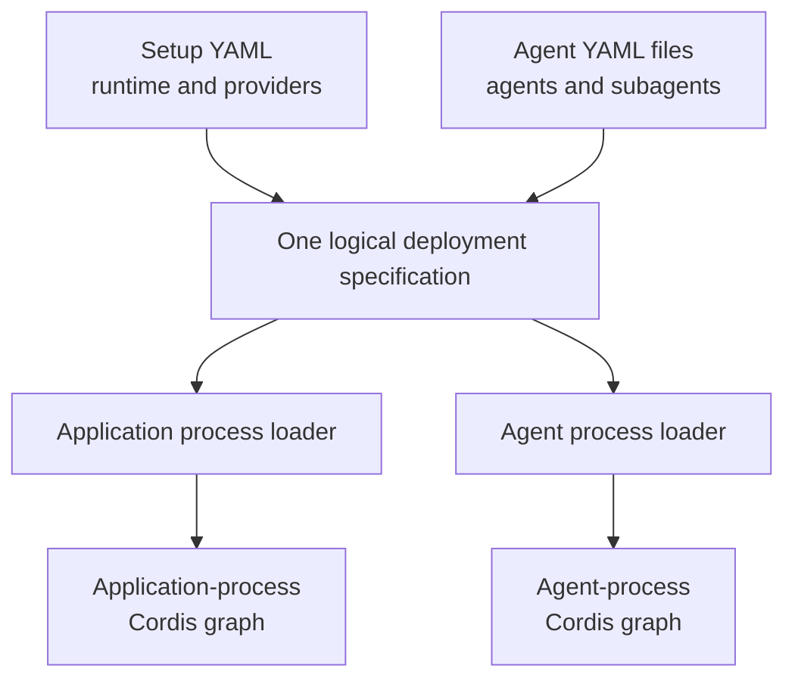
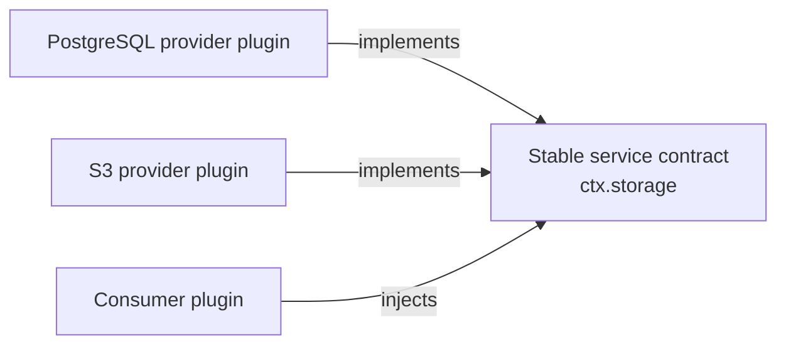
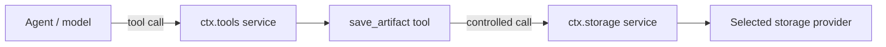
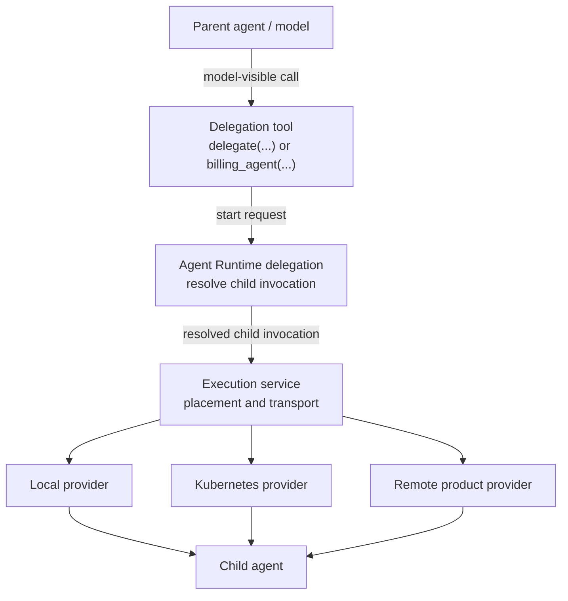
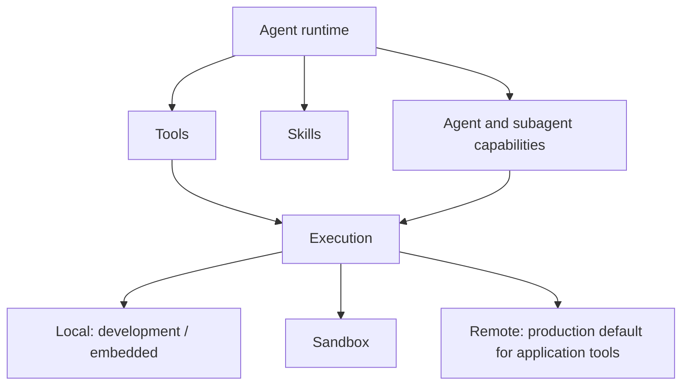
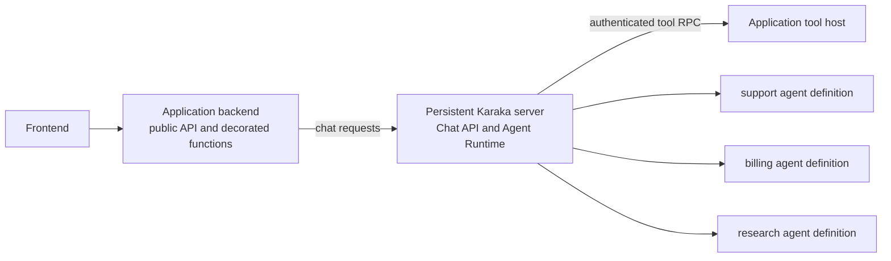

# Architecture

English | [中文](architecture.zh.md)

Karaka is a configurable, Cordis-based foundation for composing agentic SaaS runtimes. Stable capability seams define what the runtime can do, provider plugins decide how and where infrastructure work is done, and application configuration selects the product that runs. A setup-mounted integration can turn ordinary application functions into agent tools without requiring developers to author one plugin per function.

The repository publishes nine packages that form the composition kernel. Seam contracts, providers, and advanced extensions live in separately installable plugins built on that kernel. Authentication and an initial Agent Runtime registry/model slice exist today. The two-YAML loading contract, tool authoring and hosting APIs, Chat API, subagent coordination, and Execution seam described below are target architecture unless stated otherwise.

## Foundation boundary

`@karaka/cosmokit` supplies small utilities. `@karaka/schemastery` supplies configuration schemas. `@karaka/cordis` owns contexts, services, events, fibers, effects, and dependency tracking.

The composition plugins build on that kernel: Loader imports configured plugins; Include reads YAML or JSON entry lists; Group nests entries; Timer owns disposable scheduling; HMR reloads modules and exact configuration paths; Logger Console renders Cordis logs. Include technically supports JSON, but the target normal Karaka contract exposes only the two YAML surfaces below. JSON and direct Cordis composition are low-level facilities for internals and advanced plugin authors.

Infrastructure capabilities belong above this foundation in first-party, third-party, or private plugins. Karaka may publish contracts and useful providers, but a first-party provider has no privileged runtime path. Application-owned functions can use Karaka's tool authoring helper and remain ordinary application code. The `vendor/` packages remain independent of any particular application, provider, deployment target, or SaaS SDK.

## Two YAML surfaces, one composition model

The target developer contract configures Karaka through exactly two YAML surfaces:

1. One **setup YAML** contains everything needed to assemble the runtime: installed seams, providers, transports, credentials references, policy, storage, and the locations of agent files.
2. One or more **agent YAML** files define agents and subagents: prompts, logical model and session references, allowed tool IDs, skills, and delegation relationships.

The setup document controls deployment. Agent documents control model-driven behavior. They remain separate so the same agents can move between local, remote, sandboxed, or distributed deployments without describing that placement themselves.



The two surfaces form one logical deployment specification and use one composition model: plugins and effect-owned contributions. Each process owns its own Cordis context and graph. A shared-process deployment has one graph; a distributed deployment loads the relevant roles from the same specification into separate application, agent, or worker graphs.

The following illustrative partial setup fragment selects some providers and points to agent files. Provider names and configuration shapes are planned, not current API:

```yaml
- name: '@karaka/authentication'
- name: '@karaka/authentication/authentication-jwks'
- name: '@karaka/storage-postgres'
- name: '@karaka/execution-remote'
  config:
    targets:
      application:
        endpoint: https://application.internal/tools
- name: '@karaka/agent-runtime'
  config:
    agents:
      - './agents/support.yaml'
      - './agents/billing.yaml'
- name: './plugins/company-authentication-policy'
```

Each agent file contains an agent or subagent definition rather than plugin-loader entries:

```yaml
id: support
prompt: Help customers understand and manage their accounts.
model: support-model-policy
session: durable-chat-policy
tools:
  - customers.read
  - subscriptions.read
  - invoices.refund
subagents:
  billing: billing-agent
```

The planned loading layer will parse both surfaces and mount their runtime representation through Cordis. Agent definitions will become effect-owned Agent Runtime registry entries internally; developers will not author an agent plugin. Direct Cordis composition remains available for Karaka internals, tests, embedded integrations, and advanced plugin authors, but it is not a third normal configuration surface.

## Capability seams

Add an infrastructure or shared runtime capability as three independently replaceable roles:

1. A **service definition** owns the stable name and consumer-facing contract.
2. One or more **provider plugins** implement that contract.
3. **Consumer plugins** depend on the service name instead of importing a provider.

For example, a storage contract may be available as `ctx.storage`. One deployment can install a PostgreSQL provider and another an S3 provider while the same artifact, session, and billing consumers continue to use `ctx.storage`.

An application selects providers through its plugin composition. Cordis dependency tracking starts a consumer only when its required services exist. If a provider disappears or is replaced, Cordis disposes the dependent consumer and starts it again against the new implementation.



The contract must describe the capability, not a provider or consumer. Provider-specific configuration stays with the provider plugin. Consumer-specific workflow stays with the consumer plugin.

Karaka-provided and user-provided plugins use the same contract. Anything a first-party plugin can register, an advanced plugin author must be able to register through the public seam with an ordinary Cordis plugin. Karaka authoring helpers and direct Cordis plugins must receive identical dependency tracking, scoping, effects, disposal, and replacement behavior.

## Top-level seams

Karaka has seven top-level application seams. A seam is an architectural boundary composed from multiple Cordis plugins; it is not necessarily one service or one package. Models, sessions, tools, skills, agents, and subagents are parts of **Agent Runtime**, not peer top-level seams.

| Top-level seam | Responsibility | Example plugin families |
| --- | --- | --- |
| Authentication | Authenticate requests and resolve users, tenants, services, and agents | Provider registry, JWKS verifier, trusted-host identity, user-authored providers and policy |
| Authorization | Decide whether a principal may perform an action on a resource | Contract, policy engines, role or relationship providers, enforcement plugins |
| Entitlement | Resolve plans, features, quotas, and usage allowances | Contract, billing adapters, quota providers, usage policy |
| Storage | Store application data independently of a backend | Contract, PostgreSQL/S3/GCS providers, private storage providers, storage policy |
| Execution | Run work without binding consumers to its location | Contract, local/sandbox/Kubernetes/remote providers, execution policy |
| Observability | Record operational and audit information | Contract, OpenTelemetry/Datadog exporters, audit and usage plugins |
| Agent Runtime | Run and coordinate model-driven work | Model adapters, sessions, tool registry and tools, skills, agent loop, agent registry, subagent registry and providers |

Each deployment composes the plugins it needs within every seam. Karaka can publish default contracts and providers, while an application can add or replace them with ordinary Cordis plugins. Custom plugins remain the advanced extension path. Ordinary application functions use the tool helper described below and do not require developers to author a plugin.

## Authentication and invocation identity

`ctx.authentication` is a long-lived provider registry and tenant-aware authentication service. An authenticated principal is short-lived invocation data, not a Cordis service and not a plugin mounted for each caller. Karaka resolves the principal at its runtime boundary and carries it through the chat turn internally. Application code and model-visible tool arguments must not choose the effective caller.

Karaka ships two ordinary plugins for the first trust models:

| Plugin | Trust boundary | Result |
| --- | --- | --- |
| `@karaka/authentication/authentication-jwks` | Karaka receives a bearer token and verifies it against preconfigured tenant JWKS policy | Returns a verified provider-neutral identity through `ctx.authentication.authenticate(...)` |
| `@karaka/authentication/authentication-host` | The embedding host has already authenticated the caller and exposes its current principal through a trusted adapter | Resolves a provider-neutral identity with `provider: 'host'` |

The current `authentication-host` implementation still establishes `ctx.identity` in a Cordis scope. It must be refactored to the invocation resolver described here before it can back the multi-user Chat API; the existing scoped-service pattern is not the target application abstraction.

The host plugin is the common shared-process and local-development path. A single-identity development deployment may select a trusted static assertion from YAML:

```yaml
- name: '@karaka/authentication/authentication-host'
  config:
    tenantId: local
    subject: developer
    claims:
      role: developer
```

This configuration is trusted input. It must never be generated from model output or copied directly from request parameters. As an explicit embedded or custom-integration escape hatch, a multi-user host may programmatically install one adapter that reads the host framework's request-local principal:

```ts
const authentication = authenticationHost({
  currentPrincipal: () => hostAuthentication.currentPrincipal(),
})
```

The adapter is mounted once as an ordinary Cordis plugin. This is not a normal third configuration surface. Its callback is illustrative: an integration can use framework request state, asynchronous local storage, or another host mechanism, but it must not use one mutable global principal. Concurrent callers in that process share the Karaka runtime and plugin graph while the host adapter resolves a different principal for each invocation.

Identity alone never permits an action. Authorization plugins must compare the internally carried principal, requested action, and canonical resource ownership. Model-facing tools obtain the acting tenant and subject from the Agent Runtime invocation, scope storage operations to that tenant, and require an explicit cross-user permission before targeting another subject. Giving an agent an identity therefore identifies whose authority it may request; it does not grant arbitrary access to every identity.

## Services and tools

A **service** is a runtime-facing capability exposed through the Cordis context. Plugins use services to cooperate without importing one another's implementations. A top-level seam may use one service or coordinate several internal services and registries.

A **tool** is an operation intentionally exposed to a model inside the Agent Runtime seam. The target tool registry will be an internal service such as `ctx.tools`; it will own model-visible names, schemas, agent allowlists, semantic validation, and cleanup. Placement and transport belong to Execution, which will dispatch an already-resolved operation locally or to the application that owns it. Execution does not interpret model-visible schemas.

| Property | Service | Tool |
| --- | --- | --- |
| Primary caller | Runtime and plugins | Agent or model |
| Discovery | Stable `ctx.<name>` contract | Registered schema in a tool registry |
| Typical scope | Infrastructure or shared domain capability | Narrow, authorized action |
| Example | `ctx.storage.put(...)` | `save_artifact(...)` |
| Model-visible by default | No | Yes |

Registering `ctx.storage` must not make raw storage methods available to a model. A `save_artifact` tool can validate a narrow input, apply policy, call `ctx.storage`, and return a bounded result. This separation keeps internal authority out of the model-facing surface.



The same pattern applies to SaaS domains, but normal application developers should not write a plugin or setup entry for every function. Karaka will provide a decorator and an equivalent function helper. The following API is illustrative:

```ts
import { tool } from '@karaka/agent-runtime'

class InvoiceOperations {
  @tool({
    id: 'invoices.refund',
    description: 'Refund an eligible invoice.',
    input: RefundInvoiceInput,
    output: RefundInvoiceOutput,
  })
  async refund(input: RefundInvoice, invocation: ToolInvocation) {
    return this.invoices.refund(invocation.principal, input)
  }
}
```

`@tool` and `defineTool` will attach metadata only. Importing a decorated function will not register it or mutate a global registry. The setup YAML will mount one application tool-host integration. During application bootstrap, that integration will enumerate framework- or application-managed instances, read their tool metadata, bind the methods, and register local execution handlers through reversible Cordis effects. The host plugin owns those effects, so disposal removes the handlers. The helper must not create another service container, lifecycle, registry, or non-disposable global side channel.

In a remote deployment, the application-process tool-host plugin will serve a versioned manifest of its bound tools over an authenticated channel. An agent-process bridge plugin will authenticate the host, fetch and validate that manifest, and register model-visible descriptors in Agent Runtime through its own reversible effects. The application graph therefore owns handler effects, while the agent graph owns descriptor effects. A shared-process development or embedded deployment may combine both roles in one graph without changing their ownership.

The tool host will expose one manifest operation and one invocation dispatcher for all decorated functions; the decorator will not create one network route per function. Tool RPC authentication has two layers. Service authentication, such as mTLS or a service credential, proves that the call came from an authorized Karaka deployment. A short-lived, signed delegation carries the verified principal and tenant whose authority the invocation may exercise. The model cannot supply or modify either identity. On every call, the application host authenticates the service and delegation, validates the input, applies the tool's declared permission through Authorization, executes the bound function, validates the output, and records the audit event.

A conceptual invocation envelope contains an invocation ID, logical tool ID and version, validated input, deadline, and signed delegation. Credentials and the effective principal are transport metadata, never model-visible tool arguments. The manifest and invocation protocol are shared contracts, while authentication mechanisms remain replaceable providers selected in setup.

The setup YAML will configure the application target and its transport once, not once per function. Remote execution will be the likely production default for application-owned tools. Local execution will mainly serve development, tests, and embedded deployments. Both placements will expose the same logical tool IDs to Agent Runtime.

An agent YAML will explicitly select the registered tools it may use:

```yaml
id: support
tools:
  - customers.read
  - invoices.refund
```

Registration will make a tool available to the runtime; it will not grant every agent access. Agent activation must fail if an allowed tool is absent from the verified manifest or its version or schema is incompatible. Agent Runtime will validate model arguments before asking Execution to transport a call. The application host will validate the input again, authorize the internally carried principal, execute the bound method, and validate its output. Agent Runtime will validate the returned output before giving it to the model. Advanced developers may contribute tools directly from custom plugins, but those contributions must follow the same registries and effect lifecycle.

## Chat ownership and application API

Karaka owns the agent, chat, session, model and tool orchestration. Ordinary application code supplies a message and, when continuing an existing chat across a stateless boundary, an opaque chat identifier. It does not construct an identity, invocation context, agent instance, session object, or conversation state.

A future application-facing API should preserve this boundary. The names below are illustrative:

```ts
const chat = await karaka.chat.create()

const first = await chat.send('Help me review this invoice')

const later = await karaka.chat.send({
  chatId: chat.id,
  message: 'Now explain the refund policy',
})
```

The bound `chat.send(message)` and stateless `karaka.chat.send({ chatId, message })` forms invoke the same operation. The chat handle only retains the opaque identifier for the application. Karaka owns the associated identity binding, selected agent, session state, history, and execution metadata.

Creating a chat coordinates the installed seams:

```text
chat.create()
    -> authenticate the current caller
    -> authorize chat creation
    -> check entitlements
    -> select an agent through the installed routing policy
    -> resolve Agent Runtime contributions
    -> create and persist session state and chat ownership
    -> return an opaque chat ID
```

Sending a message restores and enforces that state:

```text
chat.send({ chatId, message })
    -> authenticate the current caller
    -> load the chat
    -> authorize that caller against canonical chat ownership
    -> restore the selected agent and session state
    -> resolve models, tools, skills and delegation policy
    -> execute and persist the turn
    -> return the response
```

A chat ID is a locator, never proof of authority. Karaka must authenticate and authorize every operation so one user cannot gain access by presenting another user's chat ID. One Karaka instance and one agent definition can serve many concurrent callers; each chat retains distinct ownership and state without mounting per-request Cordis plugins.

## Agent Runtime internals

Agent Runtime is one top-level seam composed from model, session, tool, skill, agent, and subagent components. Provider and integration plugins may expose internal Cordis services so these components remain replaceable without becoming top-level Karaka seams.

### Agent definitions and contributions

Developers will define every agent and subagent in agent YAML, while Karaka will create and run them. An agent definition is declarative data, not a live object, TypeScript callback, or plugin that normal application code must assemble. A subagent is another named agent definition referenced by a parent.

For example, `agents/support.yaml` can contain:

```yaml
id: support
prompt: Help customers understand and manage their accounts.
model: support-model-policy
session: durable-chat-policy
tools:
  - customers.read
  - subscriptions.read
  - invoices.refund
subagents:
  billing: billing-agent
  research: customer-research-agent
```

References in an agent definition will name logical capabilities or policies, not concrete provider objects or endpoints. Decorated application functions and advanced tool plugins will provide logical tool names; setup-selected model and session providers will satisfy the other references. Replacing OpenAI with DeepSeek, PostgreSQL with another session backend, or remote execution transport therefore will not require rewriting the agent.

The Agent Runtime integration will read the configured agent files and translate them into reversible Cordis registry contributions. File removal, replacement, and hot reload therefore will update the same registry lifecycle as plugin contributions. This internal translation will preserve Cordis layering without requiring one authored plugin or setup row per agent.

Agent routing will remain a setup-selected plugin contribution. On `chat.create()`, Karaka will ask the installed routing policy to select among available YAML definitions using trusted runtime information such as the authenticated principal, tenant, entitlements, and product configuration. A product may optionally expose an agent choice as an application-level request, but Karaka will still authorize and resolve that request; the application will not construct the agent.

Agent definitions, extensions, routers, tool semantics, model policies, session policies, and delegation semantics all live inside the Agent Runtime seam. They may use internal registries such as `ctx.agentRuntime`; they do not become additional top-level seams. Advanced plugins may extend or generate definitions, but the normal developer surface remains agent YAML.

Plugins define behavior and capabilities. A principal, chat, message, model response, or tool invocation is runtime data flowing through those plugins, not another plugin. This distinction preserves Cordis composition without misusing service isolation for per-request state.

An agent is a runtime participant with its own conversation state, tools, skills, and authority. A subagent is not simply a direct child object exposed to the parent model. The target Agent Runtime delegation path has three layers:

1. A **model-facing tool** accepts a task from the parent agent.
2. An **Agent Runtime delegation policy** resolves the named child, decides conversation inheritance and explicitly granted capabilities, and constructs the complete child invocation.
3. The **Execution service** places and transports that resolved invocation locally, in a sandbox, or in a remote runtime.



The model-facing API can be one generic tool with an agent selector or several domain-specific tools. A `research_agent` tool might route to Kubernetes while a `billing_agent` tool routes to a remote application runtime. The parent model and agent YAML do not need to know how either child is executed.

Control and reporting are explicit capabilities. Operations such as sending a follow-up, interrupting a child, listing children, or reporting a result should be separate tools or service methods with their own policy. Parent and child must not communicate through hidden shared mutable state.

Conversation inheritance, runtime composition, and authority are independent decisions owned by Agent Runtime and its delegation policy. The policy may fork the parent conversation, start with a fresh prompt, or delegate to a remote product. It constructs a resolved child invocation containing only the context and capabilities explicitly granted to that child. Execution may place and transport that invocation; it must not infer, add, or reinterpret conversation context, tools, services, credentials, filesystem access, or permissions.

## Deployment is below the capability model

Agent Runtime describes what tools and agents mean. Execution decides where and how their work runs. It owns placement, transport, dispatch, deadlines, cancellation, and provider selection without understanding prompts or model-visible schemas. Keeping these dimensions separate allows the same capability to move between in-process, sandboxed, Kubernetes, or remote execution without changing the model-facing contract.



Deployment placement also does not imply authorization. Authentication, authorization, entitlement, credentials, and audit policy remain applied at runtime boundaries regardless of provider location.

### Running Karaka and scaling agents

The target server deployment starts one persistent Karaka process from the setup YAML. A future executable entrypoint, conceptually `karaka start --config karaka.yaml`, will create the root Cordis context, load setup and agent files, mount the Chat API and selected providers, and keep the process alive. This name is illustrative, not current API.

One process loads many agent definitions into one Agent Runtime registry. An agent is a named definition, not a process, so adding a support, billing, research, or reporting agent does not require another server. Each chat resolves one definition and carries separate principal, session, history, and execution state. A subagent is another definition and initially runs through the same runtime unless Execution policy places it in an isolated or remote worker.



The baseline production topology therefore has the existing application backend and one Karaka server. The application deployment contains decorated functions and the tool-host plugin; the Karaka deployment contains the Agent Runtime, agent definitions, model providers, and remote Execution bridge. Neither deployment absorbs the other's implementation.

Capacity scaling uses multiple identical Karaka replicas behind the deployment platform's load balancer. Every replica loads the same versioned setup and agent definitions. Chat ownership, history, session state, and execution metadata must live in shared durable Storage rather than process memory so any replica can continue a chat. Replica count belongs to Docker, Kubernetes, ECS, systemd, or another deployment system; setup may define runtime concurrency and resource policy, but agent YAML never defines process count.

Additional worker roles are introduced only for a concrete placement need, such as untrusted sandbox execution, durable background work, isolated subagents, or self-hosted inference. Execution routes those resolved workloads without changing agent definitions or creating a process per agent.

## Application and extension APIs

A future Karaka code API has two deliberately different purposes:

1. The application-facing Chat API provides simple imperative operations such as creating a chat and sending a message. Karaka performs the cross-seam orchestration behind that facade.
2. Tool helpers such as `@tool` and `defineTool` mark ordinary application functions for the setup-installed application tool host to register.

These APIs do not form another configuration surface. Setup remains in one setup YAML, and agents and subagents remain in agent YAML files. In particular, the normal API does not provide a programmatic `defineAgent` path parallel to agent YAML.

Setup selects two role-specific integration plugins for a remote deployment. The application tool host turns decorated metadata into Cordis-owned Execution handlers. The agent bridge turns the verified manifest into Cordis-owned Agent Runtime descriptors. Each plugin is mounted once in its process and uses that process's existing service container, registries, effects, scopes, and dependency ordering. A shared-process deployment may mount both roles in one graph.

Conceptually:

```text
@tool / defineTool metadata
        |
        v
application tool-host plugin
        |
        v
reversible Execution handler effects

authenticated, verified manifest
        |
        v
agent bridge plugin
        |
        v
reversible Agent Runtime descriptor effects
```

Advanced developers can author ordinary Cordis plugins to add or replace services, providers, policies, registries, and generated contributions. Those plugins need module entries and serializable setup configuration so Loader can deploy them. Direct programmatic composition is reserved for internals, tests, embedded integrations that require runtime values, and custom plugin authors.

The code API must not create parallel storage, authentication, Agent Runtime, lifecycle, tool, or plugin registries. In each process, the Chat API and tool integration delegate to services and contributions in that process's Cordis graph; they do not own hidden registries or permanent global registrations. Two composition systems would duplicate dependency ordering, scoping, cleanup, and hot replacement, and would make Cordis lifecycle guarantees stop at the code API boundary.

Plugin authors can replace a provider, add a definition extension, install a policy, or use Cordis directly without leaving the architecture. Ordinary application request code should not see `ctx`, provider names, authentication assertions, invocation envelopes, session objects, or Cordis scopes.

## Ownership and scope

Every service registration, tool definition, provider entry, listener, child plugin, and scheduled resource is an effect owned by its contributing plugin. Disposing that plugin must reverse the contribution. Registries must not retain disposed entries or children.

Use Cordis service isolation for plugin-graph composition, such as when a statically configured subtree needs a distinct implementation or registry view. Do not use service isolation to represent each request, principal, message, or chat. Those are runtime data, and per-invocation authority must be carried internally through the execution path. Scope narrows service resolution; it does not establish or copy authority automatically. Policies should be attached at the service or execution seam they govern so every consumer, including a model-facing tool, passes through the same enforcement point.

The Loader and Include modifications recorded in [vendor/README.md](../vendor/README.md) preserve transactional updates so a rejected configuration does not destroy the active tree.

## Design rules

- Keep one composition system: Cordis.
- Use one logical deployment specification and one Cordis graph per process.
- Expose exactly two normal configuration surfaces: one setup YAML and one or more agent YAML files.
- Put runtime assembly, providers, transports, policy, and agent-file locations in setup YAML.
- Put agents, subagents, prompts, logical capability references, and tool allowlists in agent YAML.
- Make ordinary providers addressable as plugin modules with serializable setup configuration.
- Give first-party, third-party, and private plugins the same public extension path.
- Name services after capabilities, not vendors.
- Keep service contracts independent of providers and consumers.
- Keep models, sessions, tools, skills, agents, and subagents inside the Agent Runtime seam.
- Let applications create chats and send messages without constructing identities, sessions, agents, or invocation contexts.
- Treat a chat ID as an opaque locator and authenticate and authorize every chat operation.
- Translate agent YAML into reversible Agent Runtime contributions that reference logical capabilities and policies.
- Do not require normal developers to author an agent plugin or use a programmatic agent-definition API.
- Keep principals, chats, messages, responses, and invocations as runtime data rather than Cordis plugins or services.
- Expose model actions through narrow tools; do not expose whole services implicitly.
- Let ordinary application functions become tools through `@tool` or `defineTool`, without per-function YAML or authored plugins.
- Make decorators metadata-only; importing application code must not mutate a registry.
- Mount the tool-host integration once through setup, enumerate managed instances, bind decorated methods, and register them through reversible Cordis effects.
- Discover remote tools through an authenticated, versioned, schema-verified manifest and fail agent activation when required tools are missing or incompatible.
- Keep tool semantics and allowlists in Agent Runtime; put placement, transport, and invocation in Execution.
- Configure an application execution target once, not once per function; prefer remote execution for production application tools and local execution for development or embedded use.
- Expose decorated application functions through one authenticated manifest and invocation dispatcher, not one route or setup entry per function.
- Authenticate both the Karaka service and the short-lived delegated principal on every remote tool invocation; never accept authority from model arguments.
- Keep tool registration separate from the application service or function a tool consumes.
- Resolve subagent inheritance and the complete child invocation in Agent Runtime; let Execution only place and transport it.
- Treat agents and subagents as definitions in a shared runtime registry, not as processes.
- Start with one persistent Karaka server, scale with identical replicas and shared durable state, and add specialized workers only for placement or isolation.
- Keep replica count in the deployment platform rather than agent YAML.
- Specify context, tool, credential, and authority inheritance independently.
- Select providers in application composition, not in capability consumers.
- Register every contribution as a reversible Cordis effect.
- Keep product behavior out of the nine-package kernel; use ordinary application code for decorated functions and custom plugins for advanced extensions.
