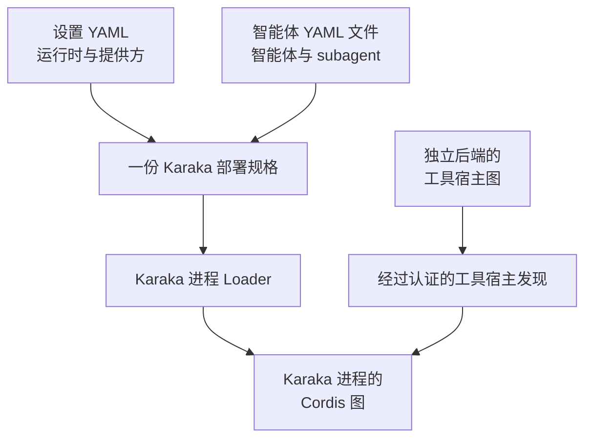
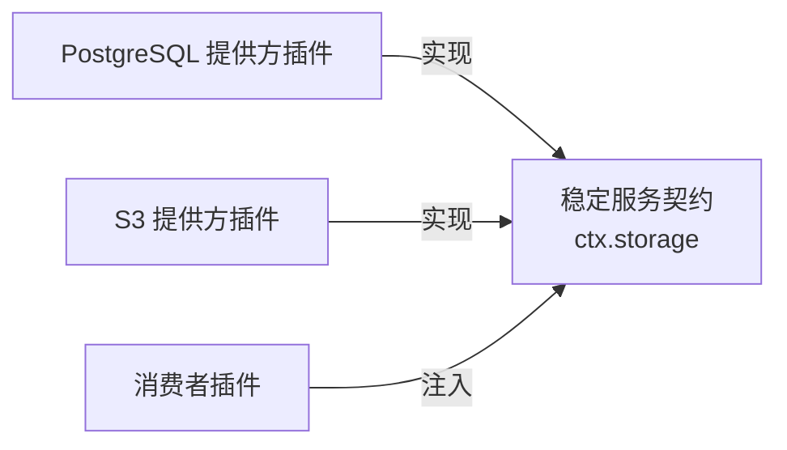
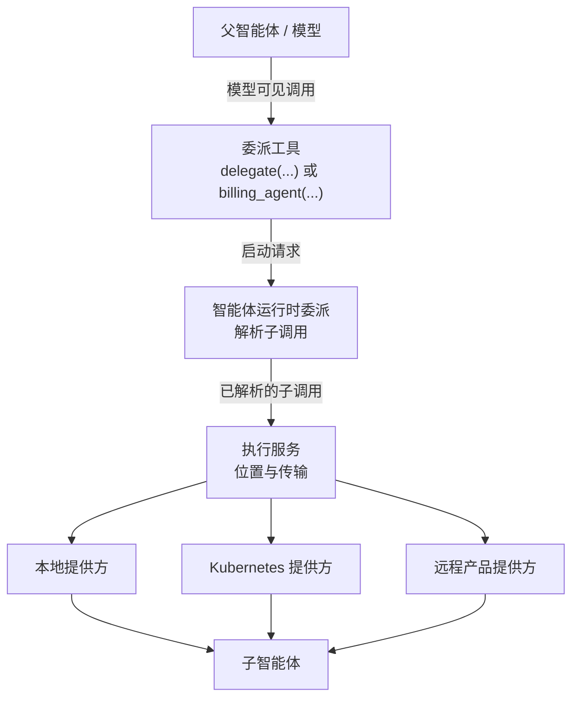
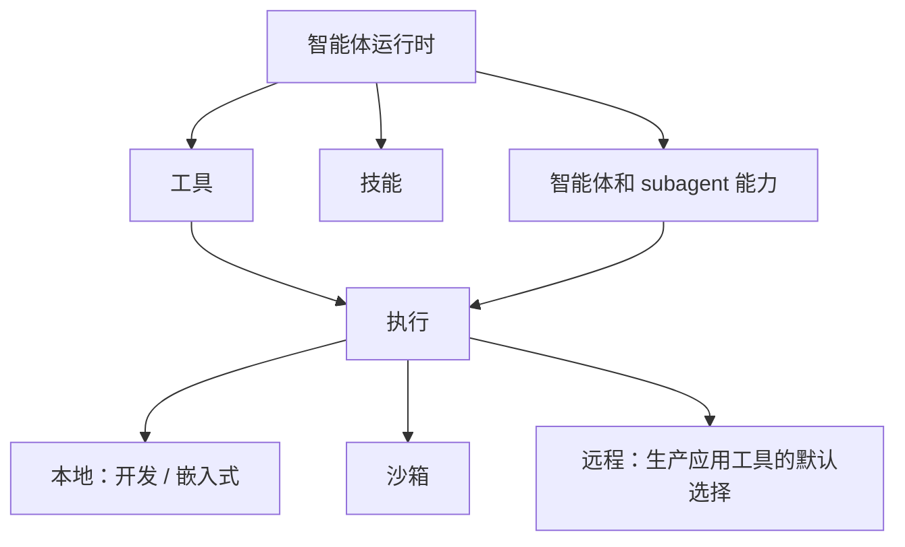
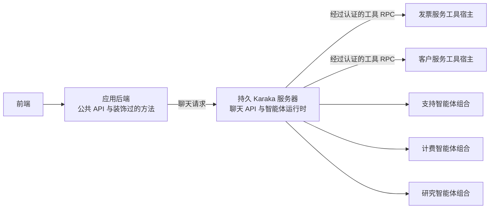

# 架构

[English](architecture.md) | 中文

Karaka 是基于 Cordis 的可配置基础层，用于组合智能体 SaaS 运行时。稳定的能力接缝定义运行时能做什么，提供方插件决定基础设施工作如何以及在何处完成，应用配置则选择实际运行的产品。后端中挂载的集成可以把框架托管服务上经过装饰的方法转换为智能体工具，而无需开发者为每个方法编写一个插件。

本仓库发布构成组合内核的九个包。接缝契约、提供方和高级扩展位于建立在该内核之上的可独立安装插件中。目前已经实现认证以及智能体运行时最初的注册表/模型切片。除非另有说明，下文的两类 YAML 加载契约、工具编写与宿主 API、聊天 API、subagent 协调和执行接缝都是目标架构。

## 基础层边界

`@karaka/cosmokit` 提供小型工具；`@karaka/schemastery` 提供配置 schema；`@karaka/cordis` 管理上下文、服务、事件、fiber、effect 和依赖跟踪。

组合插件建立在该内核之上：Loader 导入配置中的插件；Include 读取 YAML 或 JSON 配置项列表；Group 嵌套配置项；Timer 管理可释放的调度任务；HMR 重载模块和精确配置路径；Logger Console 输出 Cordis 日志。Include 在技术上支持 JSON，但 Karaka 面向普通开发者的目标契约只暴露下文两类 YAML。JSON 和直接 Cordis 组合是供内部代码与高级插件作者使用的底层能力。

基础设施能力应位于该基础层之上，并由第一方、第三方或私有插件提供。Karaka 可以发布契约、标准智能体行为和实用的提供方，但第一方实现没有特权运行路径。应用自有方法可以使用 Karaka 的工具装饰器，并继续作为普通后端代码。`vendor/` 包应与具体应用、提供方、部署目标或 SaaS SDK 保持独立。

## 两类 YAML，一种组合模型

目标开发者契约只通过两类 YAML 配置 Karaka：

1. 一份**设置 YAML**包含组装运行时所需的一切：已安装接缝、提供方、传输、凭据引用、策略、存储以及智能体文件的位置。
2. 一份或多份**智能体 YAML**为智能体和 subagent 定义具名、常驻的 Cordis 插件组合：提示词、逻辑模型与会话引用、允许的工具 ID、技能、委派关系以及可选自定义插件。

设置文档控制部署，智能体文档控制模型驱动的行为。二者分离后，同一智能体可以在本地、远程、沙箱或分布式部署之间迁移，而无需在自身定义中描述执行位置。



这两类 YAML 构成一份 Karaka 部署规格，并使用同一种组合模型：插件和由 effect 所有的贡献项。每个进程拥有自己的 Cordis context 和图。嵌入式部署可以在一张图中同时挂载应用工具宿主和智能体运行时。独立部署的后端通过框架集成和应用配置启动自己的小型工具宿主图；它们无需共享 Karaka 的设置 YAML 或仓库。经过认证的 manifest 与调用协议连接这些图。

下面是说明性的部分设置片段，它选择提供方、发现远程工具宿主并指向智能体文件。提供方名称和配置结构都属于规划中的 API，并非当前 API：

```yaml
plugins:
  - name: '@karaka/authentication'
  - name: '@karaka/authentication/authentication-jwks'
  - name: '@karaka/storage-postgres'
  - name: '@karaka/execution-remote'
  - name: '@karaka/tool-discovery-kubernetes'
    config:
      selector:
        karaka.ai/tool-host: 'true'
  - name: '@karaka/agent-runtime'
  - name: './plugins/company-authentication-policy'

agents:
  - './agents/support.yaml'
  - './agents/billing.yaml'
```

每个智能体文件都是一份具名插件组合。简洁字段配置标准子贡献项，`plugins` 列表则添加或替换智能体专属行为：

```yaml
id: support
prompt:
  file: '../prompts/support.md'
model: support-model-policy
session: durable-chat-policy
tools:
  - customers.read
  - subscriptions.read
  - invoices.refund
subagents:
  billing: billing-agent
plugins:
  - name: '@karaka/agent-standard'
  - name: '@company/karaka-support-policy'
```

设置层解析智能体文件位置，但不解释文件内容。智能体运行时把每份文件挂载为一个隔离、常驻的 Cordis 子树，并通过该子树拥有的 effect 注册组合描述符。因此，提示词、模型、会话、工具、技能、委派和自定义插件贡献项都遵循普通 Cordis 的依赖顺序、隔离、释放和替换语义。开发者在 YAML 中编写智能体组合；只有自定义行为才需要 TypeScript 模块。直接使用 Cordis 组合仍适用于 Karaka 内部、测试、嵌入式集成和高级插件作者，但不是第三种普通配置界面。

## 能力接缝

添加基础设施或共享运行时能力时，应实现三个可独立替换的角色：

1. **服务定义**拥有稳定名称和面向消费者的契约。
2. 一个或多个**提供方插件**实现该契约。
3. **消费者插件**依赖服务名，而不导入具体提供方。

例如，存储契约可以通过 `ctx.storage` 提供。一个部署可以安装 PostgreSQL 提供方，另一个部署可以安装 S3 提供方，而相同的制品、会话和计费消费者继续使用 `ctx.storage`。

应用通过插件组合选择提供方。Cordis 依赖跟踪只在必需服务存在时启动消费者。如果提供方消失或被替换，Cordis 会释放依赖它的消费者，然后针对新实现重新启动消费者。



契约必须描述能力，而非提供方或消费者。提供方专属配置属于提供方插件，消费者专属工作流属于消费者插件。

Karaka 提供的插件和用户提供的插件使用相同契约。第一方插件能够注册的任何内容，高级插件作者都必须能够通过公共接缝，以普通 Cordis 插件进行注册。Karaka 编写辅助 API 和直接编写的 Cordis 插件必须获得完全相同的依赖跟踪、作用域、effect、释放和替换行为。

## 顶层接缝

Karaka 有七个顶层应用接缝。接缝是由多个 Cordis 插件组成的架构边界，不一定对应单个服务或单个包。模型、会话、工具、技能、智能体和 subagent 都属于**智能体运行时**，不是同级的顶层接缝。

| 顶层接缝 | 职责 | 插件系列示例 |
| --- | --- | --- |
| 认证 | 验证请求并解析用户、租户、服务和智能体身份 | 提供方注册表、JWKS 验证器、可信宿主身份、用户编写的提供方和策略 |
| 授权 | 判断某个主体能否对资源执行操作 | 契约、策略引擎、角色或关系提供方、强制执行插件 |
| 权益 | 解析套餐、功能、配额和用量许可 | 契约、计费适配器、配额提供方、用量策略 |
| 存储 | 独立于具体后端存储应用数据 | 契约、PostgreSQL/S3/GCS 提供方、私有存储提供方、存储策略 |
| 执行 | 运行工作，而不让消费者绑定到执行位置 | 契约、本地/沙箱/Kubernetes/远程提供方、执行策略 |
| 可观测性 | 记录运行信息和审计信息 | 契约、OpenTelemetry/Datadog 导出器、审计和用量插件 |
| 智能体运行时 | 运行并协调模型驱动的工作 | 模型适配器、会话、工具注册表和工具、技能、智能体循环、智能体注册表、subagent 注册表和提供方 |

每个部署在各接缝内组合所需插件。Karaka 以普通第一方插件发布实用默认实现，应用则可以通过相同 Cordis 契约添加或替换它们。尤其是，标准智能体 bundle 可以组合默认循环、会话协调、工具调用处理、用户交互、委派、子智能体控制、技能解析、取消和运行时事件，而不把这些行为硬编码进智能体运行时。普通后端方法使用下文的工具装饰器，无需开发者为每个方法编写插件。

## 认证与调用身份

`ctx.authentication` 是长期存在的提供方注册表和租户感知认证服务。已认证主体是短期调用数据，不是 Cordis 服务，也不是为每个调用方挂载的插件。Karaka 在运行时边界解析主体，并在内部将其传递到整个聊天轮次。应用代码和模型可见的工具参数都不能选择实际调用方。

Karaka 为最初的两种信任模型提供普通插件：

| 插件 | 信任边界 | 结果 |
| --- | --- | --- |
| `@karaka/authentication/authentication-jwks` | Karaka 接收 bearer token，并根据预先配置的租户 JWKS 策略进行验证 | 通过 `ctx.authentication.authenticate(...)` 返回已验证且提供方无关的身份 |
| `@karaka/authentication/authentication-host` | 嵌入宿主已完成调用方认证，并通过可信适配器暴露当前主体 | 解析提供方无关、且 `provider` 为 `'host'` 的身份 |

当前 `authentication-host` 实现仍会在 Cordis 作用域中建立 `ctx.identity`。它必须重构为这里描述的调用解析器，才能支持多用户聊天 API；现有的作用域服务模式不是目标应用抽象。

host 插件是共享进程和本地开发的常见路径。单一身份的开发部署可以通过 YAML 选择可信的静态断言：

```yaml
- name: '@karaka/authentication/authentication-host'
  config:
    tenantId: local
    subject: developer
    claims:
      role: developer
```

这些配置属于可信输入，绝不能由模型输出生成，也不能直接复制请求参数。作为明确的嵌入式或自定义集成逃生舱口，多用户宿主可以编程式安装一个适配器，由它读取宿主框架的请求局部主体：

```ts
const authentication = authenticationHost({
  currentPrincipal: () => hostAuthentication.currentPrincipal(),
})
```

该适配器作为普通 Cordis 插件挂载一次。这不是第三种普通配置界面。示例中的回调只是概念说明：集成可以使用框架请求状态、异步局部存储或其他宿主机制，但不能使用单个可变的全局主体。同一进程内的并发调用方共享 Karaka 运行时和插件图，而宿主适配器为每次调用解析不同主体。

身份本身从不允许任何操作。授权插件必须比较内部传递的主体、请求动作和权威资源归属。面向模型的工具从智能体运行时调用中取得实际租户和 subject，将存储操作限制在该租户内，并在目标是其他 subject 时要求明确的跨用户权限。因此，为智能体提供身份只是在说明它可以请求使用谁的权限，并不授予对所有身份的任意访问。

## 服务与工具

**服务**是通过 Cordis 上下文暴露的、面向运行时的能力。插件通过服务协作，无需导入彼此的实现。一个顶层接缝可以使用一个服务，也可以协调多个内部服务和注册表。

**工具**是智能体运行时接缝内有意暴露给模型的操作。目标工具注册表将是类似 `ctx.tools` 的内部服务；它负责模型可见名称、schema、智能体允许列表、语义验证和清理。执行位置和传输属于执行接缝，由它在本地分发已经解析完成的操作，或者把操作发送给拥有该函数的应用。执行接缝不解释模型可见 schema。

| 属性 | 服务 | 工具 |
| --- | --- | --- |
| 主要调用方 | 运行时和插件 | 智能体或模型 |
| 发现方式 | 稳定的 `ctx.<name>` 契约 | 工具注册表中已注册的 schema |
| 典型范围 | 基础设施或共享领域能力 | 范围狭窄、经过授权的操作 |
| 示例 | `ctx.storage.put(...)` | `save_artifact(...)` |
| 默认对模型可见 | 否 | 是 |

注册 `ctx.storage` 绝不能让模型直接使用原始存储方法。`save_artifact` 工具可以验证范围狭窄的输入、应用策略、调用 `ctx.storage`，再返回有界结果。这种分离可以避免内部权限泄漏到面向模型的界面。


同一模式也适用于 SaaS 领域，但普通应用开发者不应为每个方法编写插件或设置项。Karaka 将为后端框架已经创建的服务实例提供方法装饰器。下面的 API 仅用于说明：

```ts
import { tool } from '@karaka/tool-host'

class InvoiceService {
  @tool({
    id: 'invoices.refund',
    description: 'Refund an eligible invoice.',
    input: RefundInvoiceInput,
    output: RefundInvoiceOutput,
    permission: 'invoices.refund',
  })
  async refund(input: RefundInvoice) {
    return this.database.transaction(() => this.refundInvoice(input))
  }
}
```

`@tool` 只附加元数据。导入装饰过的类不会注册它，也不会修改全局注册表。框架专属的应用工具宿主集成会在应用启动时枚举由后端框架管理的实例，读取其工具元数据，绑定对应方法，再通过可逆 Cordis effect 注册本地执行处理器。宿主插件拥有这些 effect，因此释放插件时会移除处理器。装饰器不得创建第二套服务容器、生命周期、注册表或不可释放的全局旁路。无法检查容器的框架可能需要一个应用级宿主注册点，但绝不需要为每个方法提供一条 YAML 配置。

在远程部署中，每个应用或微服务的工具宿主插件都会通过经过认证的通道提供带版本的已绑定工具 manifest。智能体进程的发现桥接插件通过静态来源或 Kubernetes、Consul、Cloud Map 等服务发现提供方寻找可信工具宿主；认证每个宿主；获取并验证其 manifest；再通过可逆 effect 向智能体运行时注册模型可见描述符。因此，应用图拥有处理器 effect，智能体图拥有描述符 effect。仓库和源码语言不是集成边界：manifest 与调用协议必须与语言无关。共享进程的开发或嵌入式部署可以把两个角色组合在一张图中，而不改变各自的所有权。

工具宿主将为所有装饰过的方法暴露一个 manifest 操作和一个调用分发器；装饰器不会为每个方法创建一条网络路由。工具 RPC 认证分为两层。mTLS 或服务凭据等服务认证证明调用来自获准的 Karaka 部署；短期签名委派则携带本次调用可以使用其权限的已验证主体和租户。模型不能提供或修改这两种身份。每次调用时，应用宿主都会认证服务和委派、验证输入、通过授权接缝执行工具声明的权限、调用已绑定方法、验证输出并记录审计事件。

概念上的调用信封包含调用 ID、逻辑工具 ID 与版本、已验证输入、截止时间和签名委派。凭据与实际主体属于传输元数据，绝不是模型可见的工具参数。Manifest 与调用协议是共享契约，认证机制则仍是由设置选择的可替换提供方。

设置 YAML 配置一个或多个工具宿主发现提供方，而不是为每个方法或源码仓库提供配置项。每个后端发现自己的装饰方法；Karaka 发现经过认证的运行中宿主及其 manifest。远程执行是生产应用自有工具的默认选择，因为业务逻辑应留在拥有其数据、事务和授权的服务中。Karaka 内的本地执行只用于 Karaka 自有控制能力、测试和明确的嵌入式部署。两种位置都会向智能体运行时暴露逻辑工具 ID，而不会把端点写进智能体 YAML。

智能体 YAML 将显式选择它可以使用的已注册工具：

```yaml
id: support
tools:
  - customers.read
  - invoices.refund
```

发现工具只表示运行时可以找到它，并不授予每个智能体调用权限。如果允许列表中的工具不在已验证 manifest 中，或其版本或 schema 不兼容，智能体激活必须失败。智能体运行时会先验证模型参数，再要求执行接缝传输调用。拥有该工具的后端会再次验证输入，使用内部传递的主体授权请求，执行绑定方法，并验证输出。智能体运行时还会验证返回的输出，再将其交给模型。工具 ID 必须全局稳定；发现层必须拒绝相互冲突的所有者或不兼容描述符，不能依赖到达顺序。Karaka 原生控制工具可以由智能体运行时插件贡献，但应用业务工具通常保持远程执行。

## 聊天所有权与应用 API

Karaka 管理智能体、聊天、会话、模型和工具编排。普通应用代码只提供消息；跨越无状态边界继续既有聊天时，再提供一个不透明的聊天标识符。应用不构造身份、调用上下文、智能体实例、会话对象或对话状态。

未来面向应用的 API 应保持这一边界。以下名称仅用于说明：

```ts
const chat = await karaka.chat.create()

const first = await chat.send('Help me review this invoice')

const later = await karaka.chat.send({
  chatId: chat.id,
  message: 'Now explain the refund policy',
})
```

绑定式 `chat.send(message)` 和无状态式 `karaka.chat.send({ chatId, message })` 调用的是同一操作。聊天句柄只为应用保留不透明标识符。Karaka 管理与其关联的身份绑定、已选智能体、会话状态、历史记录和执行元数据。

创建聊天时会协调已安装的各个接缝：

```text
chat.create()
    -> 认证当前调用方
    -> 授权创建聊天
    -> 检查权益
    -> 通过已安装的路由策略选择智能体
    -> 解析智能体运行时贡献项
    -> 创建并持久化会话状态与聊天所有权
    -> 返回不透明聊天 ID
```

发送消息时会恢复并强制执行这些状态：

```text
chat.send({ chatId, message })
    -> 认证当前调用方
    -> 加载聊天
    -> 根据权威聊天所有权授权该调用方
    -> 恢复已选智能体和会话状态
    -> 解析模型、工具、技能和委派策略
    -> 执行并持久化该轮次
    -> 返回响应
```

聊天 ID 只是定位符，绝不是权限凭证。Karaka 必须认证并授权每次操作，防止用户仅凭另一个用户的聊天 ID 获得访问权。一份常驻智能体组合可以服务多个并发调用方。每个活动聊天可以拥有一个连接到该组合的临时运行时作用域，但主体、消息、历史和持久插件状态仍是调用或会话数据，而不是为每次请求挂载的服务。

## 智能体运行时内部结构

智能体运行时是一个顶层接缝，由模型、会话、工具、技能、智能体和 subagent 组件组成。提供方和集成插件可以暴露内部 Cordis 服务，使这些组件可以独立替换，而不会因此成为 Karaka 的顶层接缝。

### 智能体定义与贡献项

开发者将在智能体 YAML 中把每个智能体和 subagent 定义为具名 Cordis 插件组合，Karaka 则负责挂载并运行它们。定义是一份由多个聊天共享的常驻组合，不是活的对话对象，也不要求普通开发者编写 TypeScript 模块。subagent 是另一份由父智能体按名称引用的组合。

例如，`agents/support.yaml` 可以包含：

```yaml
id: support
prompt:
  file: '../prompts/support.md'
model: support-model-policy
session: durable-chat-policy
tools:
  - customers.read
  - subscriptions.read
  - invoices.refund
subagents:
  billing: billing-agent
  research: customer-research-agent
plugins:
  - name: '@karaka/agent-standard'
  - name: '@company/karaka-support-policy'
```

智能体组合中的引用指向逻辑能力或策略，而不是具体提供方对象或端点。经过认证的远程 manifest 提供逻辑应用工具名称；设置中选择的模型与会话提供方满足其他引用。因此，将 OpenAI 替换为 DeepSeek、将 PostgreSQL 替换为另一种会话后端，或者替换远程执行传输，都不需要重写智能体。

智能体运行时把每份智能体文件挂载为拥有隔离常驻作用域的组合根。该根拥有自身描述符、简写字段贡献项、显式子插件和清理逻辑。简洁的 `prompt`、`model`、`session`、`tools`、`skills` 与 `subagents` 字段配置第一方子贡献项；`plugins` 列表在同一作用域内挂载额外 Cordis 模块。因此，文件移除、替换和热重载使用与其他插件子树相同的依赖与 effect 生命周期，而不是把智能体转换为扁平的 `{ id, prompt, model }` 注册表对象。

Karaka 应以普通第一方插件提供良好默认实现。说明性的 `@karaka/agent-standard` bundle 组合默认智能体循环、会话协调、模型与工具调用处理、用户交互能力、subagent 委派与控制、技能解析、取消限制和运行时事件。其中部分能力会暴露面向模型的工具，其他能力则是内部服务或事件。应用无需逐项配置即可使用该 bundle，也能通过相同公共 Cordis 接缝替换其中某种行为；智能体循环不得内置具有特权且不可替换的策略版本。解析后组合的检查命令应展示每个 bundle 背后的具体插件。

智能体 YAML 不会隐式继承另一份智能体 YAML。复用来自共享插件包、标准 bundle 和 Cordis 父作用域。`subagents` 配置项声明委派关系，而不是提示词、工具、会话或权限继承。任何未来的定义级继承必须先规定确定性的合并、循环、重载和版本规则，才能进入公共格式。

智能体路由仍将是由设置选择的插件贡献项。执行 `chat.create()` 时，Karaka 将要求已安装的路由策略使用已认证主体、租户、权益和产品配置等可信运行时信息，从可用 YAML 定义中作出选择。产品可以选择向应用暴露智能体选择，但 Karaka 仍会授权并解析该请求；应用不会自行构造智能体。

智能体组合、扩展、路由器、工具语义、模型策略、会话策略和委派语义都位于智能体运行时接缝内部。它们可以使用 `ctx.agentRuntime` 等内部服务，但不会因此成为新的顶层接缝。高级插件可以贡献行为或生成组合，但普通开发者界面仍是智能体 YAML。

插件定义行为和能力。主体、聊天、消息、模型响应或工具调用是流经这些插件的运行时数据，不是另一个插件。这一区分既保留 Cordis 组合能力，也避免误用服务隔离来表达逐请求状态。

### 组合代次与持久聊天状态

常驻智能体组合是进程局部的可执行状态；聊天是持久应用状态。聊天存储必须记录智能体 ID、组合代次或内容哈希、消息、模型请求与响应、工具调用与结果、轮次边界，以及重建行为所需的每项插件自有事实。关键插件状态不能只存在内存 `Map` 中。外部 effect 需要稳定调用 ID，避免恢复时重复执行。

智能体文件或已安装插件发生变化时，Karaka 先验证并挂载新的组合代次，再把新工作路由给它。已有活动聊天可以继续固定在当前代次，直到安全边界。进程重启后，旧 Cordis fiber 不再存在：恢复聊天时，Karaka 会针对当前已部署且兼容的代次创建新的活动作用域，加载持久日志，并让已挂载插件在发布前重建自己的投影。如果记录的代次不同，Karaka 会记录明确的组合转换，并要求新插件理解或迁移旧事件版本。精确运行历史版本属于另一种策略，需要保留历史部署制品；Cordis 无法重建已经不再部署的代码。

智能体是拥有自身对话状态、工具、技能和权限的运行时参与者。subagent 并非直接暴露给父模型的子对象。目标智能体运行时的委派路径分为三层：

1. **面向模型的工具**接收父智能体提交的任务。
2. **智能体运行时委派策略**解析具名子智能体，决定对话继承和显式授予的能力，并构造完整的子调用。
3. **执行服务**在本地、沙箱或远程运行时中放置并传输这个已解析的调用。



面向模型的 API 可以是一个带智能体选择参数的通用工具，也可以是多个领域专属工具。`research_agent` 工具可以路由到 Kubernetes，而 `billing_agent` 工具可以路由到远程应用运行时。父模型和智能体 YAML 无需知道子智能体如何执行。

控制和报告是显式能力。发送后续消息、中断子智能体、列出子智能体或报告结果等操作应是独立工具或服务方法，并拥有各自的策略。父智能体和子智能体不得通过隐藏的共享可变状态通信。

对话继承、运行时组合和权限是相互独立的决策，由智能体运行时及其委派策略负责。策略可以 fork 父对话、使用全新提示词启动，或者委派给远程产品。它会构造已解析的子调用，其中只包含显式授予该子智能体的上下文和能力。执行接缝只能放置和传输该调用；它不得推断、增加或重新解释对话上下文、工具、服务、凭据、文件系统访问或权限。

## 部署位于能力模型之下

智能体运行时描述工具和智能体的含义。执行接缝决定工作在何处以及如何运行；它负责位置、传输、分发、截止时间、取消和提供方选择，但不理解提示词或模型可见 schema。将这两个维度分离，可以在不改变面向模型契约的情况下，让同一能力在进程内、沙箱、Kubernetes 或远程执行之间迁移。



部署位置也不代表授权。无论提供方位于何处，认证、授权、权益、凭据和审计策略仍然应用于运行时边界。

### 运行 Karaka 与扩展智能体

目标服务器部署会从设置 YAML 启动一个持久 Karaka 进程。未来的可执行入口可以概念性地表示为 `karaka start --config karaka.yaml`：它创建根 Cordis context，加载设置与智能体文件，挂载聊天 API 和已选择的提供方，并保持进程运行。该名称仅用于说明，并非当前 API。

一个进程会挂载多个常驻智能体组合。智能体组合不是进程；因此，新增支持、计费、研究或报告智能体不需要再启动一台服务器。每个聊天解析一份组合，并携带独立的主体、会话、历史和执行状态。subagent 是另一份组合，最初通过同一运行时执行，除非执行策略把它放入隔离或远程 worker。



因此，基础生产拓扑由现有应用服务和一台 Karaka 服务器组成。每个应用部署包含装饰过的方法和一个小型工具宿主集成；Karaka 部署包含智能体运行时、智能体组合、智能体侧插件、模型提供方、工具宿主发现和远程执行桥接插件。两个部署都不会吸收对方的实现。Karaka 原生控制能力可以作为第一方插件在本地运行，但应用业务操作仍留在拥有其数据和授权的服务中。

对于微服务产品，推荐使用一个小型 Karaka 部署项目作为组装点。它包含设置 YAML、智能体 YAML、提示词、包清单与锁文件，以及可选的本地智能体侧插件源码。由其他仓库维护的智能体侧插件通过发布或其他方式安装进该部署制品。微服务仓库保留自身后端代码、装饰器和工具宿主集成。仓库名称与目录布局只是约定，不是运行时契约；较小或嵌入式产品可以把相同文件放在应用目录下。

工具发现跟随部署状态，而不是仓库布局。每个服务在自己由框架管理的实例中发现装饰方法，并发布经过认证且带版本的 manifest。设置选择的发现插件监视可信服务记录、获取 manifest、把兼容副本归组，并通过 effect 贡献描述符和执行端点。新增方法不需要中央设置项，但智能体仍必须在允许列表中命名逻辑工具，模型才能请求它。

容量扩展通过部署平台的负载均衡器运行多个完全相同的 Karaka 副本。每个副本加载相同版本的设置和智能体组合。聊天所有权、历史、会话状态与执行元数据必须存放在共享的持久存储中，而不是进程内存中，使任何副本都能继续聊天。副本数量属于 Docker、Kubernetes、ECS、systemd 或其他部署系统；设置可以定义运行时并发与资源策略，但智能体 YAML 绝不定义进程数量。

只有出现具体的位置需求时才引入额外 worker 角色，例如不可信沙箱执行、持久后台任务、隔离 subagent 或自托管推理。执行接缝负责路由这些已解析的工作负载，无需修改智能体组合，也不会为每个智能体创建一个进程。

## 应用与扩展 API

未来的 Karaka 代码 API 有两个刻意区分的用途：

1. 面向应用的聊天 API 提供创建聊天、发送消息等简单命令式操作。Karaka 在该门面之后完成跨接缝编排。
2. `@tool` 装饰器标记后端托管应用服务上的方法，交由该后端安装的工具宿主进行注册。

这些 API 不构成另一种 Karaka 定义格式。设置仍位于一份设置 YAML 中，智能体和 subagent 仍位于智能体 YAML 文件中。后端的框架启动逻辑和普通部署配置会安装其工具宿主，但不定义智能体。尤其是，普通 API 不提供与智能体 YAML 平行的编程式 `defineAgent` 路径。

远程部署使用两个面向不同角色的集成。每个后端启动一个应用工具宿主，把装饰器元数据转换为由 Cordis 所有的执行处理器。Karaka 的设置选择发现桥接插件，把经过验证的 manifest 转换为由 Cordis 所有的智能体运行时描述符。每个集成都在各自进程中挂载一次，并使用该进程的服务容器、注册表、effect、作用域和依赖顺序。共享进程部署可以在一张图中同时挂载这两个角色。

概念上：

```text
后端托管方法上的 @tool 元数据
        |
        v
应用工具宿主插件
        |
        v
可逆的执行处理器 effect

经过认证和验证的 manifest
        |
        v
智能体桥接插件
        |
        v
可逆的智能体运行时描述符 effect
```

高级开发者可以编写普通 Cordis 插件，以添加或替换服务、提供方、策略、注册表和智能体行为。智能体侧插件模块必须安装进 Karaka 部署制品，并由设置或智能体 YAML 引用；后端工具实现则留在所属应用制品中。直接编程式组合仅保留给内部代码、测试、需要运行时值的嵌入式集成和自定义插件作者。

代码 API 不得创建平行的存储、认证、智能体运行时、生命周期、工具或插件注册表。在每个进程中，聊天 API 和工具集成都委派给该进程 Cordis 图中的服务和贡献项，不拥有隐藏注册表或永久的全局注册。两套组合系统会重复依赖排序、作用域、清理和热替换，还会让 Cordis 的生命周期保证止步于代码 API 边界。

插件作者可以替换提供方、添加定义扩展、安装策略，或者直接使用 Cordis，而无需脱离该架构。普通应用请求代码不应看到 `ctx`、提供方名称、认证断言、调用信封、会话对象或 Cordis 作用域。

## 所有权与作用域

每个服务注册、智能体描述符、工具定义、提供方条目、监听器、子插件和调度资源都是由其贡献插件拥有的 effect。释放智能体组合根时必须释放其子插件并撤销所有贡献。注册表不得保留已释放的条目或子对象。

Cordis 服务隔离应用于插件图组合，包括需要不同实现或注册表视图的常驻智能体子树。活动聊天可以通过自有运行时作用域暂时连接该组合，但服务隔离不得表达持久请求、主体、消息或聊天状态。这些状态从存储加载，并在内部沿执行路径传递。作用域会收窄服务解析范围，但不会自动建立或复制权限。策略应附加到其治理的服务或执行接缝上，使包括面向模型的工具在内的每个消费者都经过相同的强制执行点。

[vendor/README.md](../vendor/README.md) 中记录的 Loader 和 Include 修改保证配置更新具有事务性，因此被拒绝的配置不会破坏活动插件树。

## 设计规则

- 只保留一套组合系统：Cordis。
- 使用一份 Karaka 部署规格，并让每个进程拥有一张 Cordis 图；独立部署的后端图通过经过认证的协议连接，而不是共享配置。
- 只暴露两类普通配置界面：一份设置 YAML 和一份或多份智能体 YAML。
- 将运行时组装、提供方、传输、策略和智能体文件位置放入设置 YAML。
- 让每份智能体 YAML 成为具名、常驻的 Cordis 插件组合，其中包含提示词、逻辑能力引用、工具允许列表、subagent 引用和可选自定义插件。
- 使普通提供方能够通过插件模块和可序列化的设置配置寻址。
- 为第一方、第三方和私有插件提供相同的公共扩展路径。
- 以能力而非厂商命名服务。
- 保持服务契约独立于提供方和消费者。
- 将模型、会话、工具、技能、智能体和 subagent 保留在智能体运行时接缝内。
- 让应用创建聊天和发送消息，而无需构造身份、会话、智能体或调用上下文。
- 将聊天 ID 视为不透明定位符，并对每次聊天操作执行认证和授权。
- 将每份智能体 YAML 挂载为隔离组合根，使其描述符、子插件和贡献项共享一套可逆 Cordis 生命周期。
- 让普通开发者能够在 YAML 中组合智能体，无需匹配的 TypeScript 模块或编程式智能体定义 API。
- 以可替换第一方插件和可检查的标准 bundle 提供实用默认智能体行为；不要在智能体循环中硬编码可替换策略。
- 将 subagent 引用视为委派，而不是隐式的定义、提示词、工具、会话或权限继承。
- 持久化重建聊天和插件自有状态所需的每项事实；只有通过明确的版本处理或迁移，才能在新的兼容组合代次下恢复聊天。
- 将主体、聊天、消息、响应和调用保留为运行时数据，而不是 Cordis 插件或服务。
- 通过范围狭窄的工具暴露模型操作；不要隐式暴露整个服务。
- 让后端托管应用服务上的方法通过 `@tool` 成为工具，无需逐方法 YAML 或开发者编写的插件。
- 装饰器只附加元数据；导入应用代码不得修改注册表。
- 在每个后端启动时挂载一个工具宿主集成，枚举其受管理实例，绑定装饰过的方法，并通过可逆 Cordis effect 注册它们。
- 通过设置选择的静态或服务发现插件寻找远程工具宿主，再使用经过认证、带版本且完成 schema 验证的 manifest；缺少必需工具或工具不兼容时，智能体激活必须失败。
- 将工具语义和允许列表留在智能体运行时，将位置、传输和调用放入执行接缝。
- 配置工具宿主发现，而不是单个方法或源码仓库；生产应用工具保持远程执行，本地执行只用于 Karaka 自有控制、测试和明确的嵌入式场景。
- 每个工具宿主通过一个经过认证的 manifest 和调用分发器暴露装饰过的应用方法，而不是为每个方法创建一条路由或设置项。
- 每次远程工具调用都要认证 Karaka 服务与短期委派主体；绝不从模型参数中接受权限。
- 将工具注册与其消费的应用服务或方法分开。
- 在智能体运行时中解析 subagent 的对话、上下文、能力、凭据与权限继承以及完整子调用；执行接缝只负责放置和传输。
- 将智能体和 subagent 视为共享运行时中的常驻插件组合，而不是进程。
- 从一台持久 Karaka 服务器开始，通过完全相同的副本和共享持久状态扩展；只有位置或隔离需要时才增加专用 worker。
- 将副本数量留给部署平台，而不是智能体 YAML。
- 分别说明上下文、工具、凭据和权限的继承规则。
- 在应用组合中选择提供方，而不是在能力消费者中选择。
- 将每项贡献注册为可逆的 Cordis effect。
- 不要让产品行为进入九包内核；由后端拥有的装饰方法承载业务操作，智能体侧插件承载高级编排行为。
