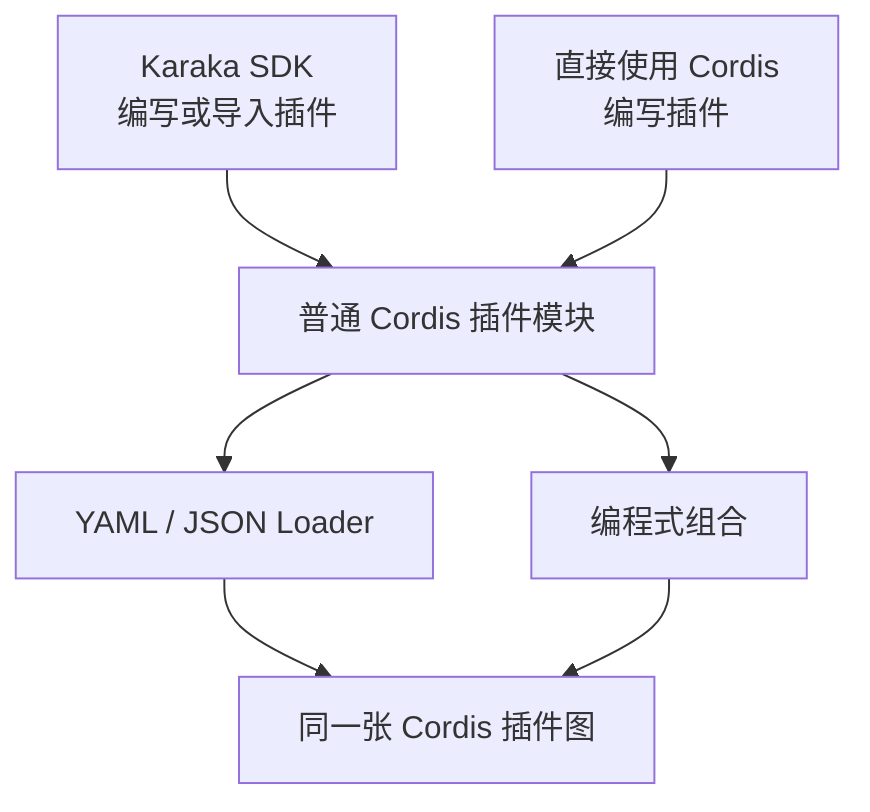
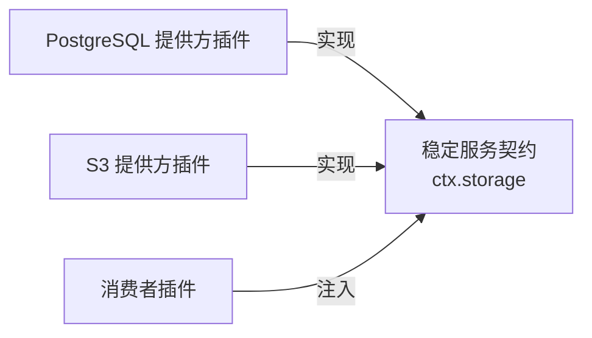
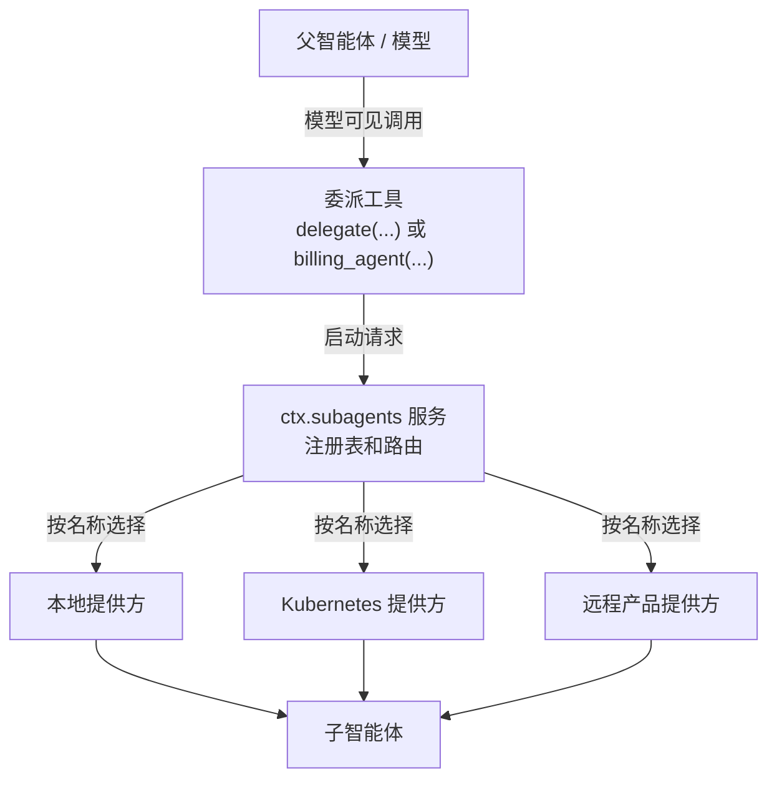
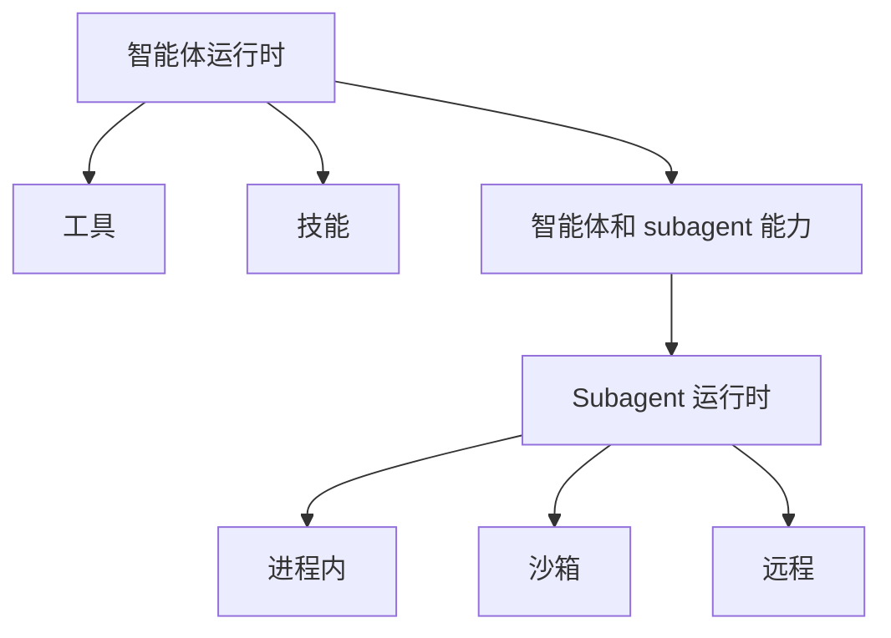

# 架构

[English](architecture.md) | 中文

Karaka 是基于 Cordis 的可配置基础层，用于组合智能体 SaaS 运行时。其架构是一个插件生态：稳定的能力接缝定义运行时能做什么，提供方插件决定如何以及在何处完成工作，应用配置则选择实际运行的产品。

本仓库发布构成组合内核的九个包。应用能力位于建立在该内核之上的可独立安装插件中。认证是第一个已实现的应用接缝；存储、执行、可观测性和智能体运行时仍是后续包的架构边界。

## 基础层边界

`@karaka/cosmokit` 提供小型工具；`@karaka/schemastery` 提供配置 schema；`@karaka/cordis` 管理上下文、服务、事件、fiber、effect 和依赖跟踪。

组合插件建立在该内核之上：Loader 导入配置中的插件；Include 读取 YAML 或 JSON 配置项列表；Group 嵌套配置项；Timer 管理可释放的调度任务；HMR 重载模块和精确配置路径；Logger Console 输出 Cordis 日志。

应用能力应位于该基础层之上，并由第一方、第三方或私有插件提供。Karaka 可以发布契约和实用的提供方，但第一方提供方没有特权运行路径。`vendor/` 包应与具体应用、提供方、部署目标或 SaaS SDK 保持独立。

## 一张图，两个入口

配置是核心架构边界。YAML 或 JSON 组合与未来的 TypeScript SDK 是构建同一张 Cordis 插件图的两种方式。



标准部署单元是插件模块及其配置。Loader 可以选择已发布的提供方或私有应用插件，无需了解插件的编写方式：

```yaml
- name: '@karaka/authentication'
- name: '@karaka/authentication/authentication-jwks'
- name: '@karaka/storage-postgres'
- name: '@karaka/execution-kubernetes'
- name: './plugins/company-billing'
- name: './plugins/company-authentication-policy'
```

另一个部署可以替换任意配置项，同时保留消费者。Loader 解析每个模块，并最终通过 Cordis 挂载它。编程式组合直接挂载相同的插件导出。两条路径都不会创建另一套服务容器或生命周期系统。

## 能力接缝

添加应用能力时，应实现三个可独立替换的角色：

1. **服务定义**拥有稳定名称和面向消费者的契约。
2. 一个或多个**提供方插件**实现该契约。
3. **消费者插件**依赖服务名，而不导入具体提供方。

例如，存储契约可以通过 `ctx.storage` 提供。一个部署可以安装 PostgreSQL 提供方，另一个部署可以安装 S3 提供方，而相同的制品、会话和计费消费者继续使用 `ctx.storage`。

应用通过插件组合选择提供方。Cordis 依赖跟踪只在必需服务存在时启动消费者。如果提供方消失或被替换，Cordis 会释放依赖它的消费者，然后针对新实现重新启动消费者。



契约必须描述能力，而非提供方或消费者。提供方专属配置属于提供方插件，消费者专属工作流属于消费者插件。

Karaka 提供的插件和用户提供的插件使用相同契约。第一方插件能够注册的任何内容，用户都必须能够通过公共接缝，以普通 Cordis 插件进行注册。用户可以使用 Karaka 编写辅助 API，也可以直接使用 Cordis；两种方式必须获得完全相同的依赖跟踪、作用域、effect、释放和替换行为。

## 顶层接缝

Karaka 有七个顶层应用接缝。接缝是由多个 Cordis 插件组成的架构边界，不一定对应单个服务或单个包。模型、会话、工具、技能、智能体和 subagent 都属于**智能体运行时**，不是同级的顶层接缝。

| 顶层接缝 | 职责 | 插件系列示例 |
| --- | --- | --- |
| 认证 | 验证请求并解析用户、租户、服务和智能体身份 | 提供方注册表、JWKS 验证器、可信宿主身份、用户编写的提供方和策略 |
| 授权 | 判断某个主体能否对资源执行操作 | 契约、策略引擎、角色或关系提供方、强制执行插件 |
| 权益 | 解析套餐、功能、配额和用量许可 | 契约、计费适配器、配额提供方、用量策略 |
| 存储 | 独立于具体后端存储应用数据 | 契约、PostgreSQL/S3/GCS 提供方、私有存储提供方、存储策略 |
| 执行 | 运行工作，而不让消费者绑定到执行位置 | 契约、本地/沙箱/Kubernetes/远程提供方、执行策略 |
| 可观测性 | 记录运行信息和审计信息 | 契约、OpenTelemetry/Datadog 导出器、审计和用量插件 |
| 智能体运行时 | 运行并协调模型驱动的工作 | 模型适配器、会话、工具注册表和工具、技能、智能体循环、智能体注册表、subagent 注册表和提供方 |

每个部署在各接缝内组合所需插件。Karaka 可以发布默认契约和提供方，应用也可以用普通 Cordis 插件添加或替换它们。计费、研究、支持或报告等 SaaS 领域插件消费这些接缝，并可贡献额外服务或智能体运行时工具。

## 认证与上下文身份

认证有两个相关但不同的输出。`ctx.authentication` 是提供方注册表和租户感知的验证服务；`ctx.identity` 则是为某个请求、会话、任务或智能体运行建立的主体。代表调用方执行操作的消费者应注入 `identity`，而不能从模型可见的工具参数中接受实际调用方身份。

Karaka 为最初的两种信任模型提供普通插件：

| 插件 | 信任边界 | 结果 |
| --- | --- | --- |
| `@karaka/authentication/authentication-jwks` | Karaka 接收 bearer token，并根据预先配置的租户 JWKS 策略进行验证 | 通过 `ctx.authentication.authenticate(...)` 返回已验证且提供方无关的身份 |
| `@karaka/authentication/authentication-host` | 嵌入宿主已完成调用方认证，并断言得到的主体 | 提供上下文 `ctx.identity`，其 `provider` 为 `'host'` |

host 插件刻意保持精简，因为它是常见的嵌入式和本地开发路径。单一身份的开发部署可以直接通过 YAML 选择它：

```yaml
- name: '@karaka/authentication/authentication-host'
  config:
    tenantId: local
    subject: developer
    claims:
      role: developer
```

这些配置属于可信输入，绝不能由模型输出生成，也不能直接复制请求参数。共享进程的宿主会为每个调用方创建新的身份作用域，并以编程方式挂载同一个插件：

```ts
const caller = ctx.isolate('identity')

await caller.plugin(AuthenticationHost, {
  tenantId: hostPrincipal.tenantId,
  subject: hostPrincipal.subject,
  claims: hostPrincipal.claims,
})

await caller.plugin(agentRun)
```

进程可以共享，但权限不能共享。独立身份作用域会阻止并发调用方覆盖或观察彼此的主体；Cordis 释放操作会随调用方插件图一并移除该身份。

身份本身从不允许任何操作。授权插件必须比较上下文主体、请求动作和权威资源归属。面向模型的工具应从 `ctx.identity` 推导实际租户和 subject，将存储操作限制在该租户内，并在目标是其他 subject 时要求明确的跨用户权限。因此，为智能体提供身份只是在说明它可以请求使用谁的权限，并不授予对所有身份的任意访问。

## 服务与工具

**服务**是通过 Cordis 上下文暴露的、面向运行时的能力。插件通过服务协作，无需导入彼此的实现。一个顶层接缝可以使用一个服务，也可以协调多个内部服务和注册表。

**工具**是智能体运行时接缝内有意暴露给模型的操作。未来的工具注册表本身将是类似 `ctx.tools` 的内部服务；工具插件将向该服务贡献模型可见的 schema 和执行器。注册表负责发现、分发、策略和清理。各个工具通常会调用其他顶层接缝的服务来完成工作。

| 属性 | 服务 | 工具 |
| --- | --- | --- |
| 主要调用方 | 运行时和插件 | 智能体或模型 |
| 发现方式 | 稳定的 `ctx.<name>` 契约 | 工具注册表中已注册的 schema |
| 典型范围 | 基础设施或共享领域能力 | 范围狭窄、经过授权的操作 |
| 示例 | `ctx.storage.put(...)` | `save_artifact(...)` |
| 默认对模型可见 | 否 | 是 |

注册 `ctx.storage` 绝不能让模型直接使用原始存储方法。`save_artifact` 工具可以验证范围狭窄的输入、应用策略、调用 `ctx.storage`，再返回有界结果。这种分离可以避免内部权限泄漏到面向模型的界面。


同一模式也适用于 SaaS 领域。计费插件可以注入认证、授权、权益和存储服务，然后向智能体运行时贡献 `create_invoice` 或 `refund_invoice` 等范围狭窄的工具。这些注册必须是由计费插件拥有的 effect。

## 智能体运行时内部结构

智能体运行时是一个顶层接缝，由模型、会话、工具、技能、智能体和 subagent 插件组成。这些插件可以暴露内部 Cordis 服务，以便彼此独立替换，而不会因此成为 Karaka 的顶层接缝。

智能体是拥有自身对话状态、工具、技能和权限的运行时参与者。subagent 并非直接暴露给父模型的子对象。在智能体运行时内部，委派分为三层：

1. **面向模型的工具**接收父智能体提交的任务。
2. 类似 `ctx.subagents` 的 **subagent 服务**选择具名提供方并协调运行。
3. **提供方插件**在特定执行环境中启动或联系子智能体。



面向模型的 API 可以是一个带智能体或提供方选择参数的通用工具，也可以是由不同提供方支持的多个领域专属工具。`research_agent` 工具可以路由到 Kubernetes，而 `billing_agent` 工具可以路由到受限的本地运行时。父模型无需知道子智能体如何执行。

控制和报告是显式能力。发送后续消息、中断子智能体、列出子智能体或报告结果等操作应是独立工具或服务方法，并拥有各自的策略。父智能体和子智能体不得通过隐藏的共享可变状态通信。

对话继承、运行时组合和权限是相互独立的决策。提供方可以 fork 父对话、使用全新提示词启动，或者委派给远程产品。这些选择都不会自动授予子智能体父级的工具、服务、凭据、文件系统或权限。提供方契约必须说明其继承行为，组合必须显式授予子智能体能力。

## 部署位于能力模型之下

工具和智能体描述应用能做什么，提供方决定工作在何处以及如何运行。将这两个维度分离，可以在不改变面向模型契约的情况下，让同一能力在进程内、沙箱、Kubernetes 或远程执行之间迁移。



部署位置也不代表授权。无论提供方位于何处，认证、授权、权益、凭据和审计策略仍然应用于运行时边界。

## SDK 边界

未来的 Karaka SDK 是易用的 Cordis 插件编写和组合 API，而不是第二套运行时或依赖注入容器。`defineService`、`defineTool`、`defineSkill`、`defineAgent` 或 `createRuntime` 等 SDK 调用只是可能采用的公共词汇，并非当前基础层已经实现的 API。

无论 SDK 最终采用何种名称，它都必须生成普通 Cordis 插件，并将声明转换为服务提供方、消费者插件、effect、作用域和插件组合。SaaS 开发者可以安装内置提供方，也可以为同一服务契约提供自定义提供方。所有消费者都继续通过 `ctx` 解析服务。

概念上：

```text
SaaS SDK 声明
        |
        v
Cordis 插件和 effect
        |
        v
ctx 服务或注册表贡献项
```

SDK 辅助 API 可以返回插件导出，但普通能力不得只能通过不透明的工厂返回值进行配置。普通提供方需要提供模块入口和可序列化配置，使 Loader 能够通过 YAML 或 JSON 组合它们。TypeScript 仍可将不可序列化的运行时值作为显式的编程式逃生舱口。

SDK 不得创建平行的存储、认证、智能体运行时、生命周期或插件注册表。两套组合系统会重复依赖排序、作用域、清理和热替换，还会让 Cordis 的生命周期保证止步于 SDK 边界。

运行时便捷 API 可以组装根上下文并挂载插件，但生成的树仍然是普通 Cordis 树。因此，高级消费者可以替换提供方、添加策略插件、为租户或智能体隔离服务，或者直接使用 Cordis，而无需脱离该架构。

## 所有权与作用域

每个服务注册、工具定义、提供方条目、监听器、子插件和调度资源都是由其贡献插件拥有的 effect。释放该插件时必须撤销对应贡献。注册表不得保留已释放的条目或子对象。

当租户、会话或智能体需要不同实现或不同注册表视图时，应使用 Cordis 服务隔离。作用域会收窄解析范围，但不会自动复制权限。策略应附加到其治理的服务或执行接缝上，使包括面向模型的工具在内的每个消费者都经过相同的强制执行点。

[vendor/README.md](../vendor/README.md) 中记录的 Loader 和 Include 修改保证配置更新具有事务性，因此被拒绝的配置不会破坏活动插件树。

## 未来插件的设计规则

- 只保留一套组合系统：Cordis。
- 将 YAML、JSON 和 SDK 视为同一张插件图的不同入口。
- 使普通提供方能够通过插件模块和可序列化配置寻址。
- 为第一方、第三方和私有插件提供相同的公共扩展路径。
- 以能力而非厂商命名服务。
- 保持服务契约独立于提供方和消费者。
- 将模型、会话、工具、技能、智能体和 subagent 保留在智能体运行时接缝内。
- 通过范围狭窄的工具暴露模型操作；不要隐式暴露整个服务。
- 将工具注册与工具所消费的服务分开。
- 将 subagent 路由放在服务中，将执行策略放在提供方中。
- 分别说明上下文、工具、凭据和权限的继承规则。
- 在应用组合中选择提供方，而不是在能力消费者中选择。
- 将每项贡献注册为可逆的 Cordis effect。
- 以外部插件添加应用能力；不要让产品行为进入九包内核。
