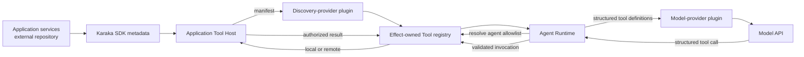

# Tool Architecture Working Draft

English | [中文](tool-architecture.zh.md)

> Status: discussion draft. This document records the current direction and unresolved questions. It does not define an implemented API or stable wire protocol.

## Purpose

Karaka must let an agent call application capabilities without moving application code into the Karaka deployment. The application backend continues to own its services, data, transactions, and authorization. Karaka owns agent orchestration and connects to those capabilities as tools.

The published Karaka SDK is implemented in this repository but consumed by application backends in other repositories. Decorated application services live with those backends, not with Karaka.

## Working boundaries

### Application SDK

The SDK provides an inert method decorator. It attaches a stable tool ID, description, input and output schemas, and a required application permission. Importing a decorated service does not register global behavior or start a server.

An application creates one Tool Host from its framework-managed service instances. The host finds decorated methods, binds them to their instances, and exposes one manifest capability and one invocation capability. Application setup identifies services once; it does not configure every function separately.

Every SDK-decorated application tool has a permission. The Tool Host authenticates the Karaka caller, resolves the delegated application principal, validates the request, asks application authorization about that permission, invokes the method, and validates the result. The exact hosting, authentication, and authorization APIs remain open.

### Karaka Tool plugins

Tool behavior in the Karaka process belongs to a plugin family inside the Agent Runtime seam. Keeping it in the seam does not mean putting every responsibility in one Agent Runtime class. Separate Cordis plugins provide registry, discovery, remote invocation, policy, and future local capabilities through effect-owned contributions.

A discovery-provider contract reports available Tool Hosts. Static configuration, DNS, Kubernetes, Consul, Cloud Map, or a private registry can implement that contract as ordinary plugins. Karaka must work without Kubernetes or Consul; neither is a privileged dependency.

A discovery bridge verifies a host and its manifest, then fills the Tool registry with logical descriptors and invocation clients. Removing or replacing the provider reverses those registrations. Duplicate tool owners or incompatible replica manifests fail closed rather than depending on discovery order.

### Agent Runtime and models

An agent plugin names the logical tool IDs it may use. Discovery makes a tool available; it does not grant every agent access.

For a model call, Agent Runtime resolves the agent's allowlist and adds the selected name, description, and input schema to a structured provider-neutral model request. Tool does not construct the system prompt. A model-provider plugin translates the structured definitions into its provider's native function-calling format.

When the model returns a structured tool call, Agent Runtime asks the Tool registry to invoke it. The registry applies validation and policy, selects the local or remote provider, and returns a structured result. Agent Runtime records the call and result, adds them to the next model request, and continues the turn.

## Cross-repository flow

The manifest path and invocation path are different operations over the same logical contract. No application function code or endpoint is sent to the model. The model sees only the selected tool name, description, and input shape.

## Tool categories

Application tools are normally remote and permission-bearing. They execute in the backend that owns the business operation.

Karaka-native tools provide runtime capabilities such as delegation, user interaction, session operations, progress, interruption, or skills. They are also contributed by plugins, but they need not use an application permission or a remote Tool Host.

Explicit embedded and development plugins may contribute local tools. Local and remote providers must enter the same registry and agent allowlist path; placement must not create a second tool system.

## Policy and lifecycle

Tool-call concurrency is policy, not an unconditional registry behavior. The safe default is sequential execution. A developer-installed policy plugin may permit bounded overlap based on the tool and validated arguments. Policy composition, ordering barriers, and result ordering still need a final contract.

All Karaka-side registrations belong to Cordis effects. A running turn binds a stable capability view; later turns see the currently loaded plugins. Disposal prevents new calls and lets already-started calls reach a defined terminal state. Request principals, tool calls, and results are runtime data, not per-user plugins.

## Open questions

- Which SDK exports own the decorator, Tool Host, shared manifest, and invocation types?
- What is the versioned, language-neutral manifest and invocation wire format?
- How does Karaka authenticate to a Tool Host and delegate a short-lived tenant and user identity?
- How do discovery plugins represent replicas, health, updates, and conflicting manifests?
- What is persisted so a durable chat can replay tool calls and results after a restart?
- How do scheduling-policy plugins combine, and how are parallel calls bounded and committed in order?
- Which failures become model-visible tool results, and which terminate the agent turn?
- What are the timeout, retry, idempotency, and unknown-outcome rules for remote side effects?
- How does a framework-neutral Tool Host attach to an application's existing server and request context?
- Which Karaka-native tools ship as sensible default plugins?

These questions should be resolved incrementally before the document is promoted from a working draft to normative architecture.
