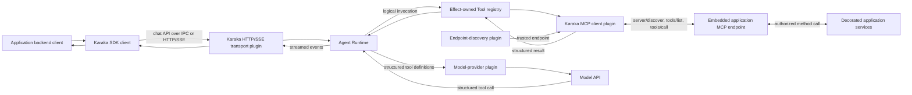

# Tool and Transport Architecture Working Draft

English | [中文](tool-architecture.zh.md)

> Status: discussion draft. This document records the current direction and unresolved questions. It does not define an implemented API or a stable compatibility promise.

## Purpose

Karaka must let an application talk to its agents and let those agents call application capabilities without moving application code into the Karaka deployment. These are two different communication directions with different contracts:

1. The application calls Karaka through the Karaka API.
2. Karaka calls application tools through the Model Context Protocol (MCP).

Both can use HTTP, but they must not be treated as the same API.

## Application to Karaka

The application backend uses the Karaka SDK to create or resume a chat, send input, stream output, and cancel work. Transport follows the deployment boundary: direct invocation within one process, operating-system IPC such as a Unix domain socket or named pipe between colocated processes, and Karaka's HTTP API with SSE for streamed events across a network.

**Avoidable transport latency is an architectural defect even when model inference dominates total turn time. Same-host deployments must not take a network path merely because HTTP/SSE already exists.**

The SDK owns the developer-facing API. Its internal client transport maps those operations onto the configured Karaka endpoint. Each carrier implements the same SDK contract and has a matching server-side Karaka plugin, so selecting IPC does not change chat semantics.

This API is not MCP. It represents Karaka concepts such as agents, chats, turns, events, and cancellation rather than exposing each agent as an MCP tool. An optional MCP-facing Karaka transport may be added later, but it is not the primary application API.

## Karaka to application tools

### Application Tool API

The published `@karaka/tool` package is implemented in this repository but consumed by application backends in other repositories. Its root provides an inert method decorator that attaches a stable tool ID, description, input and output schemas, and a required application permission. Importing a decorated service does not register global behavior or start a server.

The current `@karaka/tool/mcp-server` plugin receives the application's framework-managed service instances and a reversible mount callback for the application's existing backend server. It discovers decorated methods, binds them through the Tool Core registry, and exposes them through one MCP endpoint. Future framework-specific adapters provide the instance enumeration and mount callback automatically. Application setup identifies services once; it does not configure every function in YAML or start a separate tool deployment.

Every SDK-decorated application tool has a permission. The MCP endpoint authenticates Karaka, resolves the delegated application principal, validates the request, asks application authorization about that permission, invokes the method, and validates the result. The business backend continues to own its services, data, transactions, and authorization.

### MCP boundary

The draft targets MCP Streamable HTTP for remote application tools. After Karaka knows an endpoint, its MCP client uses the standard protocol operations instead of a Karaka-specific manifest and invocation protocol:

- `server/discover` inspects the known endpoint and its capabilities.
- `tools/list` returns available tool definitions and schemas.
- `tools/call` invokes a selected tool.
- MCP list-change notifications or polling refresh the registered view.

MCP does not locate application endpoints. Endpoint discovery and protocol discovery are separate:

- A discovery-provider plugin supplies trusted MCP endpoint URLs and service identity.
- The MCP client inspects each known endpoint and discovers its tools through MCP.

Static configuration is the minimum provider. DNS, Kubernetes, Consul, Cloud Map, or private registries may implement the same Cordis discovery contract. No infrastructure-specific provider is privileged.

The current application MCP server pins the modern MCP `2026-07-28` revision and rejects legacy protocol traffic. The future client bridge should initially pin the same revision; any compatibility window must be an explicit later decision. The protocol references are the [MCP 2026-07-28 specification](https://modelcontextprotocol.io/specification/2026-07-28), its [Streamable HTTP transport](https://modelcontextprotocol.io/specification/2026-07-28/basic/transports), and its [tools contract](https://modelcontextprotocol.io/specification/2026-07-28/server/tools).

### Karaka Tool plugins

Tool behavior in the Karaka process belongs to a plugin family inside the Agent Runtime seam. This does not put every responsibility in one Agent Runtime class. Separate Cordis plugins contribute:

- an effect-owned logical Tool registry;
- endpoint-discovery providers;
- an MCP client bridge;
- invocation and scheduling policy;
- Karaka-native and optional local tools.

The MCP client bridge consumes discovered endpoints, negotiates their capabilities, calls `tools/list`, verifies descriptors, and contributes logical tools to the registry. It uses `tools/call` for remote invocation. Removing or replacing the bridge or discovery provider reverses its registrations. Duplicate logical owners or incompatible replica schemas fail closed rather than depending on discovery order.

Agent Runtime only uses the Tool registry. It neither discovers endpoints nor handles MCP or HTTP directly.

### Agent Runtime and models

An agent plugin names the logical tool IDs it may use. Discovery makes a tool available; it does not grant every agent access.

For a model call, Agent Runtime resolves the agent's allowlist and adds each selected tool's name, description, and input schema to a structured provider-neutral model request. The Tool family does not construct the system prompt. A model-provider plugin translates the structured definitions into its provider's native function-calling format.

When the model returns a structured tool call, Agent Runtime asks the Tool registry to invoke it. The registry validates the call, applies policy, selects the provider, and returns a structured result. Agent Runtime records the call and result, adds them to the next model request, and continues the turn.

## End-to-end flow

Application function code, service instances, and endpoint URLs are never sent to the model. The model sees only the tools selected for the current agent.

## Tool categories

Application tools are normally remote, MCP-exposed, and permission-bearing. They execute in the backend that owns the business operation.

Karaka-native tools provide runtime capabilities such as delegation, user interaction, session operations, progress, interruption, or skills. They are contributed by ordinary Cordis plugins and need not use an application permission or remote MCP server.

Explicit embedded and development plugins may contribute local tools directly. An MCP stdio provider may also be added for local subprocesses. Local, stdio, and remote tools must enter the same registry and agent allowlist path; placement must not create another tool system.

## Security

MCP supplies protocol structure, not automatic trust. The remote boundary must use trusted discovery and encrypted transport. Karaka authenticates with a short-lived, audience-bound credential; the application validates it on every call and resolves the delegated principal. The application still enforces the decorator's permission locally.

Tool descriptions and results are untrusted model input. Karaka validates schemas on both sides, agents may use only allowlisted logical tools, and the model never chooses endpoint URLs. Mutating calls are not automatically retried unless the operation has an explicit idempotency contract. The final authentication and delegated-identity profile remains open.

## Policy and lifecycle

Tool-call concurrency is policy, not unconditional registry behavior. The safe default is sequential execution. A developer-installed policy plugin may permit bounded overlap based on the tool and validated arguments. Policy composition, ordering barriers, and result ordering still need a final contract.

All Karaka-side registrations belong to Cordis effects. A running turn binds a stable capability view; later turns see the currently loaded plugins. Disposal prevents new calls and lets already-started calls reach a defined terminal state. Request principals, tool calls, and results are runtime data, not per-user plugins.

## Open questions

- How long will Karaka support the pinned MCP `2026-07-28` revision before adding or moving a compatibility window?
- What is the exact endpoint-discovery provider contract for replicas, health, updates, and conflicts?
- What authentication and delegated-identity profile will Karaka require over MCP?
- How will each supported application framework mount the MCP endpoint and supply request context?
- What is persisted so a durable chat can replay tool calls and results after a restart?
- How do scheduling-policy plugins combine, and how are parallel calls bounded and committed in order?
- Which failures become model-visible tool results, and which terminate the agent turn?
- What are the timeout, retry, idempotency, and unknown-outcome rules for remote side effects?
- Which Karaka-native tools ship as sensible default plugins?

These questions should be resolved incrementally before the document is promoted from a working draft to normative architecture.
