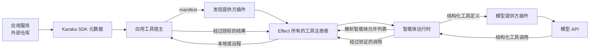

# 工具架构工作草案

[English](tool-architecture.md) | 中文

> 状态：讨论草案。本文记录当前方向与未解决问题，不定义已经实现的 API 或稳定的线协议。

## 目的

Karaka 必须让智能体能够调用应用能力，同时不把应用代码搬进 Karaka 部署。应用后端继续拥有其服务、数据、事务和授权；Karaka 拥有智能体编排，并把这些能力作为工具连接起来。

公开发布的 Karaka SDK 在本仓库中实现，但由其他仓库中的应用后端使用。经过装饰的应用服务与这些后端放在一起，而不放在 Karaka 中。

## 当前工作边界

### 应用 SDK

SDK 提供惰性的方法装饰器。它附加稳定的工具 ID、描述、输入和输出 schema，以及必需的应用权限。导入经过装饰的服务不会注册全局行为，也不会启动服务器。

应用从框架托管的服务实例创建一个工具宿主。宿主查找经过装饰的方法，把方法绑定到其实例，并暴露一个 manifest 能力和一个调用能力。应用设置只标识一次服务，而不逐个配置函数。

每个由 SDK 装饰的应用工具都有权限。工具宿主验证 Karaka 调用方、解析被委托的应用主体、验证请求、向应用授权检查该权限、调用方法并验证结果。具体的宿主、认证和授权 API 仍待确定。

### Karaka 工具插件

Karaka 进程中的工具行为属于智能体运行时接缝内的一个插件系列。位于该接缝中，并不意味着把所有责任塞进一个智能体运行时类。独立的 Cordis 插件通过 effect 所有的贡献项提供注册表、发现、远程调用、策略以及未来的本地能力。

发现提供方契约报告可用的工具宿主。静态配置、DNS、Kubernetes、Consul、Cloud Map 或私有注册中心都可以作为普通插件实现该契约。Karaka 必须能在没有 Kubernetes 或 Consul 的情况下工作；两者都不是特权依赖。

发现桥接插件验证宿主及其 manifest，再用逻辑描述符和调用客户端填充工具注册表。移除或替换提供方会撤销这些注册。重复的工具所有者或不兼容的副本 manifest 会关闭失败，而不依赖发现顺序。

### 智能体运行时与模型

智能体插件声明它可以使用的逻辑工具 ID。发现使工具对运行时可用，但不会向所有智能体授予访问权。

调用模型时，智能体运行时解析智能体的允许列表，并把选中的名称、描述和输入 schema 加入结构化、提供方中立的模型请求。工具不负责构造系统提示词。模型提供方插件把结构化定义转换成该提供方原生的函数调用格式。

模型返回结构化工具调用后，智能体运行时请求工具注册表执行它。注册表应用验证与策略，选择本地或远程提供方，并返回结构化结果。智能体运行时记录调用与结果，把它们加入下一次模型请求，然后继续本轮运行。

## 跨仓库流程

manifest 路径与调用路径是同一逻辑契约上的不同操作。应用函数代码和端点都不会发送给模型。模型只能看到选中的工具名称、描述和输入形状。

## 工具类别

应用工具通常是远程且带权限的。它们在拥有对应业务操作的后端中执行。

Karaka 原生工具提供委派、用户交互、会话操作、进度、中断或技能等运行时能力。它们同样由插件贡献，但不一定使用应用权限或远程工具宿主。

显式的嵌入式和开发插件可以贡献本地工具。本地与远程提供方必须进入同一个注册表和智能体允许列表路径；执行位置不得产生第二套工具系统。

## 策略与生命周期

工具调用并发属于策略，而不是注册表无条件提供的行为。安全默认值是顺序执行。开发者安装的策略插件可以根据工具和经过验证的参数允许有界重叠。策略组合、顺序屏障和结果顺序仍需确定最终契约。

Karaka 侧的所有注册都属于 Cordis effect。正在运行的一轮会绑定稳定的能力视图；后续轮次看到当前已加载的插件。释放会阻止新调用，并让已经开始的调用到达有明确定义的终态。请求主体、工具调用和结果都是运行时数据，而不是按用户挂载的插件。

## 未解决问题

- 哪些 SDK 导出负责装饰器、工具宿主、共享 manifest 和调用类型？
- 版本化、与语言无关的 manifest 与调用线格式是什么？
- Karaka 如何向工具宿主认证，并委托短期有效的租户和用户身份？
- 发现插件如何表示副本、健康状态、更新和互相冲突的 manifest？
- 需要持久化哪些内容，才能让持久聊天在重启后重放工具调用与结果？
- 调度策略插件如何组合，并行调用如何受限以及如何按顺序提交？
- 哪些失败成为模型可见的工具结果，哪些失败会终止智能体轮次？
- 远程副作用的超时、重试、幂等性和未知结果规则是什么？
- 与框架无关的工具宿主如何接入应用现有的服务器和请求上下文？
- 哪些 Karaka 原生工具会作为合理默认插件提供？

这些问题应逐步解决，之后才能把本文从工作草案提升为规范性架构。
