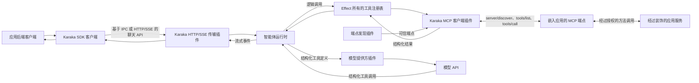

# 工具与传输架构工作草案

[English](tool-architecture.md) | 中文

> 状态：讨论草案。本文记录当前方向与未解决问题，不定义已经实现的 API，也不作稳定兼容性承诺。

## 目的

Karaka 必须让应用能够与其智能体通信，也让这些智能体能够调用应用能力，同时不把应用代码搬进 Karaka 部署。这是两个方向不同、契约也不同的通信过程：

1. 应用通过 Karaka API 调用 Karaka。
2. Karaka 通过模型上下文协议（MCP）调用应用工具。

两者都可以使用 HTTP，但不能被视为同一个 API。

## 应用到 Karaka

应用后端使用 Karaka SDK 创建或恢复聊天、发送输入、流式接收输出以及取消工作。传输方式遵循部署边界：同一进程内直接调用；同机不同进程之间使用 Unix 域套接字或命名管道等操作系统 IPC；跨网络时使用 Karaka HTTP API，并通过 SSE 传输流式事件。

**即使模型推理占据整轮运行的大部分时间，可避免的传输延迟仍然是架构缺陷。同机部署不得仅仅因为 HTTP/SSE 已经存在就绕行网络路径。**

SDK 拥有面向开发者的 API。其内部客户端传输把这些操作映射到配置的 Karaka 端点。每种载体都实现相同的 SDK 契约，并在 Karaka 服务端有匹配的插件，因此选择 IPC 不会改变聊天语义。

这个 API 不是 MCP。它表达智能体、聊天、轮次、事件和取消等 Karaka 概念，而不是把每个智能体暴露成 MCP 工具。以后可以增加一个可选的、面向 MCP 的 Karaka 传输，但它不是主要的应用 API。

## Karaka 到应用工具

### 应用工具 API

应用后端从 `@karaka/sdk` 导入惰性的方法装饰器。它为方法附加稳定的工具 ID、描述、输入和输出 schema，以及必需的应用权限。导入经过装饰的服务不会注册全局行为，也不会启动服务器。独立的 `@karaka/tool` 包包含读取这些元数据的 Cordis 运行时插件。

当前的 `@karaka/tool/mcp-server` 插件接收应用中由框架托管的服务实例，以及用于应用现有后端服务器的可逆挂载回调。它发现经过装饰的方法，通过工具核心注册表绑定这些方法，并从一个 MCP 端点暴露它们。未来的框架专属适配器会自动提供实例枚举和挂载回调。应用设置只标识一次服务，而不在 YAML 中逐个配置函数，也不会启动独立的工具部署。

每个由 SDK 装饰的应用工具都有权限。MCP 端点会认证 Karaka，只在该认证通道上接受用户上下文，然后验证请求、向应用授权检查该权限、调用方法并验证结果。业务后端继续拥有其服务、数据、事务和授权。

### MCP 边界

本草案针对远程应用工具采用 MCP Streamable HTTP。Karaka 知道端点后，其 MCP 客户端使用标准协议操作，而不使用 Karaka 专有的 manifest 和调用协议：

- `server/discover` 检查已知端点及其能力。
- `tools/list` 返回可用工具的定义和 schema，并在 `_meta["ai.karaka/toolVersion"]` 中携带逻辑版本。
- `tools/call` 调用选中的工具。
- MCP 列表变更通知或轮询刷新已注册视图。

MCP 不负责定位应用端点。端点发现与协议发现彼此独立：

- 发现提供方插件提供可信的 MCP 端点 URL 和服务身份。
- MCP 客户端检查每个已知端点，并通过 MCP 发现其中的工具。

静态配置是最小提供方。DNS、Kubernetes、Consul、Cloud Map 或私有注册中心可以实现同一个 Cordis 发现契约。任何基础设施专用提供方都不享有特权。

当前的应用 MCP 服务器和 Karaka MCP 客户端都固定使用现代 MCP `2026-07-28` 修订版，并拒绝旧版协议流量。任何兼容期都必须在以后明确决定。协议参考是 [MCP 2026-07-28 规范](https://modelcontextprotocol.io/specification/2026-07-28)、其 [Streamable HTTP 传输](https://modelcontextprotocol.io/specification/2026-07-28/basic/transports)以及[工具契约](https://modelcontextprotocol.io/specification/2026-07-28/server/tools)。

### Karaka 工具插件

Karaka 进程中的工具行为属于智能体运行时接缝内的一个插件系列。这并不意味着把所有责任塞进一个智能体运行时类。独立的 Cordis 插件贡献：

- effect 所有的逻辑工具注册表；
- 端点发现提供方；
- MCP 客户端桥接；
- 调用和调度策略；
- Karaka 原生工具和可选本地工具。

当前的 MCP 客户端插件从设置接收可信静态 HTTPS 端点、协商其能力、调用 `tools/list`、验证协议响应、Karaka 版本元数据和 schema，并向注册表贡献逻辑工具。每个请求都会经过活动的 `ctx.authentication` 提供方；`tools/call` 还会转发取消信号和已经绑定的用户上下文。工具核心会独立编译公布的 schema，并验证每次调用的输入和结果。移除该插件会撤销注册并关闭客户端。当前静态实现拒绝重复逻辑所有者，不依赖端点顺序；动态发现、兼容副本归组和列表变更刷新仍是位于同一边界之后的未来插件或扩展。

智能体运行时只使用工具注册表。它既不发现端点，也不直接处理 MCP 或 HTTP。

### 智能体运行时与模型

智能体插件声明它可以使用的逻辑工具 ID。发现使工具对运行时可用，但不会向所有智能体授予访问权。

调用模型时，智能体运行时解析智能体的允许列表，并把每个选中工具的名称、描述和输入 schema 加入结构化、提供方中立的模型请求。工具系列不负责构造系统提示词。模型提供方插件把结构化定义转换成该提供方原生的函数调用格式。

模型返回结构化工具调用后，智能体运行时请求工具注册表执行它。注册表验证调用、应用策略、选择提供方，并返回结构化结果。智能体运行时记录调用与结果，把它们加入下一次模型请求，然后继续本轮运行。

## 端到端流程

应用函数代码、服务实例和端点 URL 都不会发送给模型。模型只能看到为当前智能体选中的工具。

## 工具类别

应用工具通常是远程、通过 MCP 暴露且带权限的。它们在拥有对应业务操作的后端中执行。

Karaka 原生工具提供委派、用户交互、会话操作、进度、中断或技能等运行时能力。它们由普通 Cordis 插件贡献，不一定使用应用权限或远程 MCP 服务器。

显式的嵌入式和开发插件可以直接贡献本地工具。也可以为本地子进程增加 MCP stdio 提供方。本地、stdio 和远程工具必须进入同一个注册表和智能体允许列表路径；执行位置不得产生另一套工具系统。

## 安全

MCP 提供协议结构，但不会自动建立信任。远程边界必须使用可信发现和加密传输。所选认证插件会保护目录请求和调用请求。应用认证 Karaka 后，可以信任随请求携带的用户上下文，同时仍在本地执行装饰器声明的权限检查。

工具描述和结果都是不可信的模型输入。Karaka 在通信两端验证 schema，智能体只能使用允许列表中的逻辑工具，并且模型绝不选择端点 URL。除非操作具有明确的幂等契约，否则不会自动重试修改数据的调用。

## 策略与生命周期

工具调用并发属于策略，而不是注册表无条件提供的行为。安全默认值是顺序执行。开发者安装的策略插件可以根据工具和经过验证的参数允许有界重叠。策略组合、顺序屏障和结果顺序仍需确定最终契约。

Karaka 侧的所有注册都属于 Cordis effect。正在运行的一轮会绑定稳定的能力视图；后续轮次看到当前已加载的插件。释放会阻止新调用，并让已经开始的调用到达有明确定义的终态。请求主体、工具调用和结果都是运行时数据，而不是按用户挂载的插件。

## 未解决问题

- Karaka 在增加或调整兼容期之前，将支持固定的 MCP `2026-07-28` 修订版多久？
- 副本、健康状态、更新和冲突的端点发现提供方精确契约是什么？
- 每个受支持的应用框架如何挂载 MCP 端点并提供请求上下文？
- 需要持久化哪些内容，才能让持久聊天在重启后重放工具调用与结果？
- 调度策略插件如何组合，并行调用如何受限以及如何按顺序提交？
- 哪些失败成为模型可见的工具结果，哪些失败会终止智能体轮次？
- 远程副作用的超时、重试、幂等性和未知结果规则是什么？
- 哪些 Karaka 原生工具会作为合理默认插件提供？

这些问题应逐步解决，之后才能把本文从工作草案提升为规范性架构。
